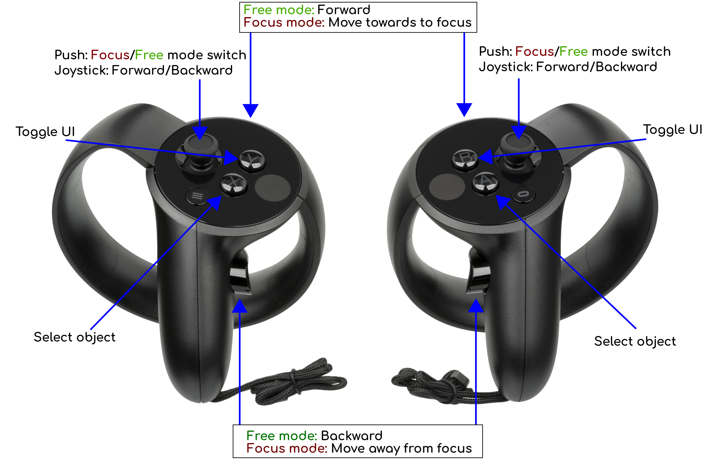

--------------------------

[](http://gaia-sky.readthedocs.io/en/latest/?badge=latest)
[](https://circleci.com/gh/langurmonkey/gaiasky/tree/master)
[](https://opensource.org/licenses/MPL-2.0)

[**Gaia Sky VR**](https://zah.uni-heidelberg.de/gaia/outreach/gaiasky) is a real-time, 3D, astronomy VR software that
runs on multiple headsets and operating systems thanks to Valve's [OpenVR](https://github.com/ValveSoftware/openvr). It is developed in the framework of
[ESA](http://www.esa.int/ESA)'s [Gaia mission](http://sci.esa.int/gaia) to chart about 1 billion stars of our Galaxy.
To get the latest up-to-date and most complete information,

*  Visit our [**home page**](https://zah.uni-heidelberg.de/gaia/outreach/gaiasky)
*  Read the [**Documentation**](http://gaia-sky.readthedocs.io) for the non-VR version
*  Submit a [**bug** or a **feature request**](https://github.com/langurmonkey/gaiasky/issues)
*  Follow development news at [@GaiaSky_Dev](https://twitter.com/GaiaSky_Dev)

This file contains the following sections:

1. [Running Gaia Sky VR](#1-running-gaia-sky-vr)
2. [Documentation and help](#2-documentation-and-help)
3. [Copyright and licensing information](#3-copyright-and-licensing-information)
4. [Contact information](#4-contact-information)
5. [Credits and acknowledgements](#5-acknowledgements)


## 1. Running Gaia Sky VR

The Gaia Sky VR project is the Virtual Reality version of Gaia Sky. At the moment, only [OpenVR](https://github.com/ValveSoftware/openvr) is supported, but nothing prevents us from supporting other APIs (like the Kronos Group's [OpenXR](https://www.khronos.org/openxr)) in the future if it makes sense. Our tests have only been carried out with the Oculus Rift CV1 headset in direct mode under Windows. Supporting Linux is a top priority for us, and the HTC Vive should work well under Linux, even though the state of OpenVR in the platform is a bit rough. We have reports indicating that the HTC Vive VR controllers' mappings are not fully working.

Also, we want to point out that Linux support for the Oculus Rift was dropped for the CV1 and it is not expected to be continued any time soon, unfortunately.

Gaia Sky VR is heavily under development, and it is not guaranteed to work. Currently, no binaries are provided, but it can still be run by compiling the source. Just keep in mind that this is the developmen branch.

### 1.1. Pre-requisites

This guide is for running Gaia Sky VR with the Oculus Rift in Windows. You will need the following: 

1. Download and install [Git for Windows](http://gitforwindows.org/) and get used to the unix-like command line interface.
2. If you are using the Oculus Rift headset, follow the provided instructions and install the Oculus app with the runtime.
3. Download and install [Steam](http://store.steampowered.com/) and then install [SteamVR](http://store.steampowered.com/steamvr).

### 1.2. Cloning the repository

First, open the Git for Windows CLI and clone the [GitHub](https://github.com/langurmonkey/gaiasky) repository and checkout the `2.0.0-vr` tag. This should give you a working version:

```
$  git clone https://github.com/langurmonkey/gaiasky.git
$  cd gaiasky
$  git checkout tags/2.0.0-vr
```

You can also use the `vr` branch directly (`git checkout vr`), but since it is a development branch, it is not guaranteed to work.

Make sure you have at least `JDK8` installed.

### 1.3. Getting the data

The TGAS catalog files (Gaia data) are **not** in the repository, so if you want to use the TGAS or DR2 data when running
from source you need to download
the corresponding `tar` file — see table below.

| **Catalog** | **Description** | **Extract location** | **Catalog file** |
|---------|-------------|----------|----------|
| [TGAS](http://gaia.ari.uni-heidelberg.de/gaiasky/files/catalogs/tgas/20171204_tgas_gpu_gaiasky_1.5.1.tar.gz)  | TGAS catalog. ~700 K stars. | `gaiasky/assets/data/catalog` | `data/catalog-tgas-hyg.json` | 
| [Gaia DR2](http://gaia.ari.uni-heidelberg.de/gaiasky/files/catalogs/dr2/20180419_dr2-20-0.5.tar.gz)  | Gaia DR2 catalog. ~9.5 M stars.  | `gaiasky/assets/data/octree/dr2` | [`data/catalog-dr2-default.json`](http://gaia.ari.uni-heidelberg.de/gaiasky/files/catalogs/dr2/catalog-dr2-default.json) | 

First, choose the package corresponding to your desired catalog and extract it into the specified **Extract location**. 
Then, you need to point the key `data.json.catalog` in your `$HOME/.gaiasky/global.vr.properties` file to the
file specified in the last column in the table (**Catalog file**). So download that file, save it in `assets/data` and select it in the data tab or edit the config file.


### 1.4. Running

To run Gaia Sky VR, make sure that both the Oculus runtime and Steam VR are running. Then, run Gaia Sky through gradle. The first time it will pull lots of dependencies and compile the whole project, so it may take a while.

```
$  gradlew.bat core:run
```

Et voilà! Gaia Sky VR dev branch is running.

In order to pull the latest version from the repository, just run the following from the `gaiasky` folder.

```
$  git pull origin vr
```

Remember that the master branch is the development branch and therefore intrinsically unstable. It is not guaranteed to always work.

##  2. Documentation and help

The most up-to-date documentation of Gaia Sky is always in [gaia-sky.readthedocs.io](http://gaia-sky.readthedocs.io).

###  2.1 Controls

Unfortunately, only the Oculus VR controllers are supported. When I get a chance to borrow an HTC Vive, I'll add mappings for it too.

Here are the current controller mappings:




##  3. Copyright and licensing information

This software is published and distributed under the MPL 2.0
(Mozilla Public License 2.0). You can find the full license
text here https://github.com/langurmonkey/gaiasky/blob/master/LICENSE.md
or visiting https://opensource.org/licenses/MPL-2.0

##  4. Contact information

The main webpage of the project is
**[https://www.zah.uni-heidelberg.de/gaia/outreach/gaiasky](https://www.zah.uni-heidelberg.de/gaia/outreach/gaiasky)**. There you can find
the latest versions and the latest information on Gaia Sky.

##  5. Acknowledgements

The latest acknowledgements are always in the [ACKNOWLEDGEMENTS.md](https://github.com/langurmonkey/gaiasky/blob/master/ACKNOWLEDGEMENTS.md) file.
