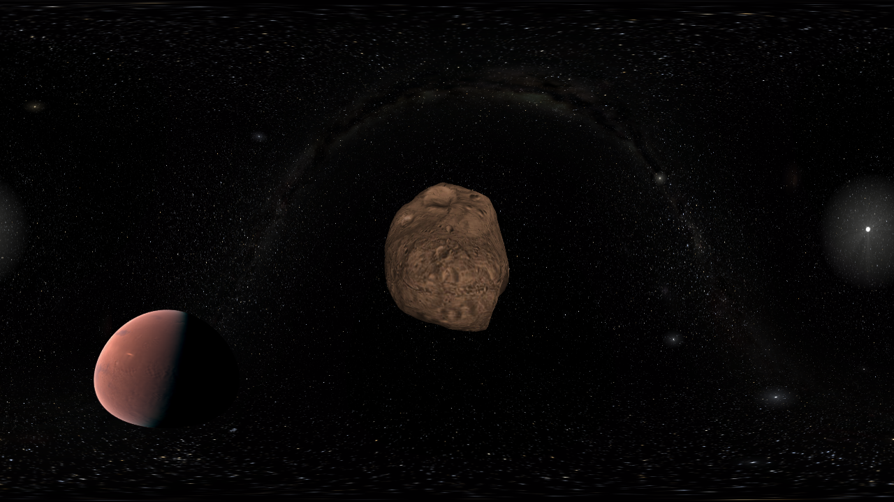

360 mode
********

Gaia Sky includes a 360 mode where the scene is rendered in all directions to a `cube map <https://en.wikipedia.org/wiki/Cube_mapping>`__.
This cube map is then projected onto a flat image using an `equirectangular projection <http://alexcpeterson.com/2015/08/25/converting-a-cube-map-to-a-sphericalequirectangular-map/>`__. The final image can be used
to create 360 videos with head tracking (see `here <https://www.youtube.com/watch?v=Bvsb8LZwkgc&t=33s>`__)

.. hint:: To activate the 360 mode, click on the |360| icon in the camera section of the controls window. Exit by clicking |360| again.

.. hint:: :kbd:`L-CTRL`+:kbd:`3` -- Can also be used to toggle the 360 mode.

Configuration
=============

Please, see the :ref:`360-mode-config` section.

Creating panorama images
========================

In order to create panorama images that can be viewed with a VR device or simply a 360 viewer, we need to take into consideration a few points.

*  Panoramas work best if their **aspect ratio is 2:1**, so a resolution of ``5300x2650`` or similar should work. (Refer to the :ref:`screenshots-configuration` section to learn how to take screenshots with an arbitrary resolution).
*  Some services (like Google) have strong constraints on image properties. For instance, they must be at least 14 megapixels and in `jpeg` format. Learn more `here <https://support.google.com/maps/answer/7012050?hl=en&ref_topic=6275604>`__.
*  Some **metadata** needs to be injected into the image file.

Injecting panorama metadata to 360 images
-----------------------------------------

To do so, we can use `ExifTool <http://owl.phy.queensu.ca/~phil/exiftool/>`__. We will inject the metadata with the following command:

.. code:: bash

  exiftool -ProjectionType="equirectangular" -UsePanoramaViewer="True" -"PoseHeadingDegrees<$exif:GPSImgDirection" -"CroppedAreaImageWidthPixels<$ImageWidth" -"CroppedAreaImageHeightPixels<$ImageHeight" -"FullPanoWidthPixels<$ImageWidth" -"FullPanoHeightPixels<$ImageHeight" -CroppedAreaLeftPixels="0" -CroppedAreaTopPixels="0" image_name.jpg

Now we can enjoy our image in any 360 panorama viewer like Google Street View app or the Cardboard Camera!
Find some examples in this `album <https://goo.gl/photos/kn2MvugZHYcr5Fty8>`__.

  Panorama image captured with Gaia Sky

