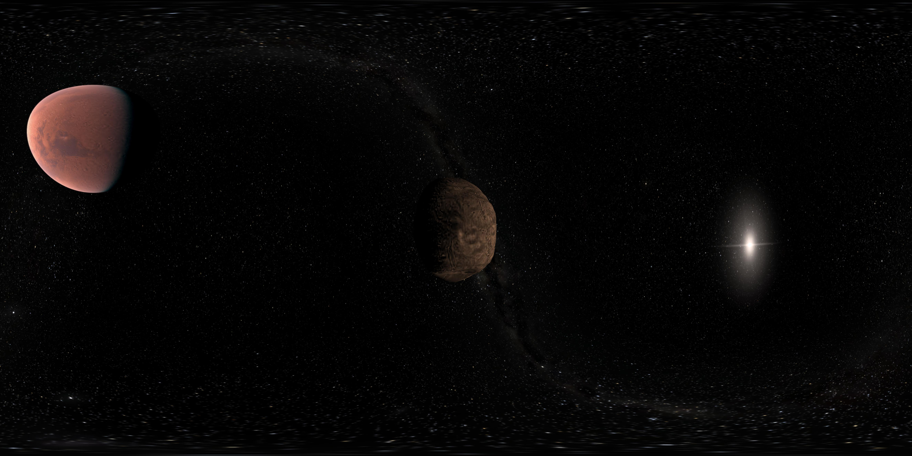
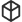

Panorama mode
*************

Gaia Sky includes a panorama mode where the scene is rendered in all directions to a `cube map <https://en.wikipedia.org/wiki/Cube_mapping>`__.
This cube map is then projected onto a flat image. The projection to use can be an `equirectangular (spherical) projection <http://alexcpeterson.com/2015/08/25/converting-a-cube-map-to-a-sphericalequirectangular-map/>`__,
a `cylindrical projection <https://en.wikipedia.org/wiki/Map_projection#Cylindrical>`__ or a `Hammer <https://en.wikipedia.org/wiki/Hammer_projection>`__ projection. The final image can be used
to create 360 videos with head tracking (see `here <https://www.youtube.com/watch?v=Bvsb8LZwkgc&t=33s>`__)

.. hint:: To activate the panorama mode, click on the |cubemap-icon| icon in the camera section of the controls window. Exit by clicking |cubemap-icon| again.

.. hint:: ``L-CTRL`` + ``K`` -- Toggle the panorama mode.
.. hint:: ``L-CTRL`` + ``L-SHIFT`` + ``K`` -- Cycle between the projections (spherical, cylindrical and Hammer).

Configuration
=============

Please, see the :ref:`360-mode-config` section.

Creating panorama images
========================

In order to create panorama images that can be viewed with a VR device or simply a 360 viewer, we need to take into consideration a few points.

*  You should probably use the equirectangular (spherical) projection, as it is the simplest and the one most programs use.
*  Panoramas work best if their **aspect ratio is 2:1**, so a resolution of ``5300x2650`` or similar should work. (Refer to the :ref:`screenshots-configuration` section to learn how to take screenshots with an arbitrary resolution).
*  Some services (like Google) have strong constraints on image properties. For instance, they must be at least 14 megapixels and in `jpeg` format. Learn more `here <https://support.google.com/maps/answer/7012050?hl=en&ref_topic=6275604>`__.
*  Some **metadata** needs to be injected into the image file.

Injecting panorama metadata to 360 images
-----------------------------------------

To do so, we can use `ExifTool <http://owl.phy.queensu.ca/~phil/exiftool/>`__ in Linux, MacOS and Windows. To inject the metadata which describes a 360 degrees 4K image (3840x2160) we need to run the following command:

.. code:: bash

  $  exiftool -UsePanoramaViewer=True -ProjectionType=equirectangular -PoseHeadingDegrees=360.0 -CroppedAreaLeftPixels=0 -FullPanoWidthPixels=3840 -CroppedAreaImageHeightPixels=2160 -FullPanoHeightPixels=2160 -CroppedAreaImageWidthPixels=3840 -CroppedAreaTopPixels=0 -LargestValidInteriorRectLeft=0 -LargestValidInteriorRectTop=0 -LargestValidInteriorRectWidth=3840 -LargestValidInteriorRectHeight=2160 image_name.jpg 

Now we can enjoy our image in any 360 panorama viewer like Google Street View app or the Cardboard Camera!
Find some examples in this `album <https://goo.gl/photos/kn2MvugZHYcr5Fty8>`__.

  Panorama image captured with Gaia Sky

Creating spherical (360) videos
===============================

First, you need to capture the 360 video. To do so, capture the images and use ``ffmpeg`` to encode them or capture the video directly using a screen recorder. See the :ref:`capture-videos` section for more information.
Once you have the ``.mp4`` video file, you must use the `spatial media <https://github.com/google/spatial-media>`__ project to inject the spherical metadata so that video players that support it can play it correctly.

First, clone the project.

.. code:: bash

  $  git clone https://github.com/google/spatial-media.git
  $  cd spatial-media/
  
Then, inject the spherical metadata with the following command. Python 2.7 must be used to run the tool, so make sure to use that version.

.. code:: bash

  $  python spatialmedia -i <inupt_file> <output_file>

You are done, your video can now be viewed using any 360 video player or even uploaded to `YouTube <https://youtube.com>`__.

To check whether the metadata has been injected correctly, just do:

.. code:: bash

  $  python spatialmedia <file>
  

  