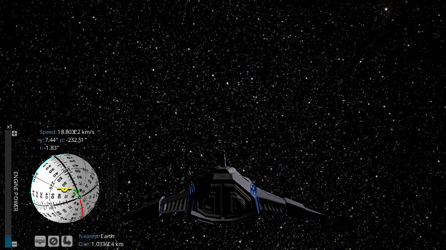

.. _camera-modes:

Camera modes
************

Gaia Sky offers five basic camera modes.

Focus mode
==========

This is the default mode. In this mode the camera movement is locked to a focus object, which can be selected by double clicking or by using the find dialog (:kbd:`Ctrl+F`).
There are two extra options available. These can be activated using the checkboxes at the bottom of the `Camera` panel in the GUI Controls window:

*  **Lock camera to object** -- If this is activated, the relative position of the camera with respect to the focus object is maintained. Otherwise, the camera position does not change.
*  **Lock orientation** -- If this is activated, the camera will rotate with the object to keep the same perspective of it at all times.

The description of the controls in focus mode can be found here:

*  :ref:`Keyboard controls in focus mode <keyboard-focus-free-mode>`
*  :ref:`Mouse controls in focus mode <mouse-focus-mode>`
*  :ref:`Gamepad controls in focus mode <gamepad-focus-mode>`

.. hint:: :kbd:`NUMPAD_1` -- Enter the Focus mode

Free mode
=========

This mode does not lock the camera to a focus object but it lets it roam free in space.

*  :ref:`Keyboard controls in free mode <keyboard-focus-free-mode>`
*  :ref:`Mouse controls in free mode <mouse-free-mode>`
*  :ref:`Gamepad controls in free mode <gamepad-free-mode>`

.. hint:: :kbd:`NUMPAD_0` -- Enter the Free mode

Gaia scene mode
===============

In this mode the camera can not be controlled. It provides a view of the Gaia satellite from the outside.

.. hint:: :kbd:`NUMPAD_2` -- Enter the Gaia scene mode

Spacecraft mode
===============

In this mode you take control of a spacecraft. In the spacecraft mode, the ``GUI`` changes completely. The Options window disappears and
a new user interface is shown in its place at the bottm left of the screen.

*  **Attitude indicator** -- It is shown as a ball with the horizon and other marks. It represents the current orientation of the spacecraft with respect to the equatorial system.

  *  |pointer| -- Indicates the direction the spacecraft is currently headed to.
  *  |greencross| -- Indicates direction of the current velocity vector, if any.
  *  |redcross| -- Indicates inverse direction of the current velocity vector, if any.

*  **Engine Power** -- Current power of the engine. It is a multiplier in steps of powers of ten. Low engine power levels allow for Solar System or planetary travel, whereas high engine power levels are suitable for galactic and intergalactic exploration.
*  |stabilise| -- Stabilises the yaw, pitch and roll angles. If rotation is applied during the stabilisation, the stabilisation is cancelled.
*  |stop| -- Stops the spacecraft until its velocity with respect to the Sun is 0. If thrust is applied during the stopping, the stopping is cancelled.
*  |exit| -- Return to the focus mode.

.. |redcross| image:: img/sc/ai-antivel.png

*  :ref:`Keyboard controls in spacecraft mode <keyboard-spacecraft-mode>`
*  :ref:`Gamepad controls in spacecraft mode <gamepad-spacecraft-mode>`

.. hint:: :kbd:`NUMPAD_3` -- Enter the Spacecraft mode

  Spacecraft mode, with the various controls at the bottom left.

Field of View mode
==================

This mode simulates the Gaia fields of view. You can select FoV1, FoV2 or both.

.. hint:: :kbd:`NUMPAD_4` -- Enter Field of View 1 mode

          :kbd:`NUMPAD_5` -- Enter Field of View 2 mode

          :kbd:`NUMPAD_6` -- Enter Field of View 1 and 2 mode
          
