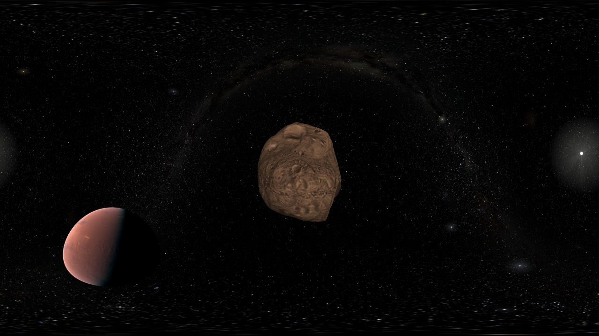

.. _configuration:

Settings and configuration
**************************

Gaia Sky can be configured using the provided ``GUI`` (**G**\ raphical **U**\ ser **I**\ nterface).
However, some functions are not represented in the GUI, so you may need
to dive deep into the :ref:`properties file <properties-file>`.

Graphics settings
=================

Please refer to the :ref:`graphics-conf` chapter.

.. _user-interface-config:

User interface
==============

The ``User Interface`` section allows the user to set the language and the
theme of the user interface.

One can select between a choice of languages using the language
drop-down. There are currently three visual themes available:

-  ``dark-orange``, black and orange theme.
-  ``dark-orange-large``, same as dark-orange, but with larger fonts.
-  ``dark-green``, black and green theme. The default since v0.800b.
-  ``light-blue``, a light theme with a blue tone.
-  ``HiDPI``, a version of the dark-orange theme to be used with high
   density (retina) screens, 4K monitors, etc.

Performance
===========

In the ``Performance`` tab you can enable and disable multithreading.
Multithreading is still an **experimental** feature, so use it at your
own risk. This allows the program to use more than one CPUs for the
processing.

Levels of Detail (LOD)
----------------------

Certain big datasets use levels of detail to prevent data clutter.
Refer to the :ref:`levels-of-detail` section for more info.

Controls
========

You can see the key associations in the ``Controls`` tab. Controls are
not editable. Check out the `Controls <Controls.rst>`_\  documentation
to know more.

Screenshot configuration
========================

You can take screenshots anytime when the application is running by
pressing ``F5``. There are two screenshot modes available: \*
``Simple``, the classic screenshot of what is currently on screen, with
the same resolution. \* ``Advanced``, where you can define the
resolution of the screenshots.

.. _frame-output-config:

Frame output
============

There is a feature in the Gaia Sky that enables the output of every
frame as an image. This is useful to produce videos. In order to
configure the frame output system, use the ``Frame output`` tab. There
you can select the output folder, the image prefix name, the output
image resolution (in case of ``Advanced`` mode) and the target frames
per second. When the program is in frame output mode, it does not run in
real time but it adjusts the internal clock to produce as many frames
per second as specified here. You have to take it into account when you
later use your favourite video encoder
(`ffmpeg <https://www.ffmpeg.org/>`__) to convert the frame images into
a video.

Camera recording
================

Here you can set the desired frames per second to capture the camera
paths. If your device is not fast enough in producing the specified
frame rate, the application will slow down while recording so that
enough frames are captured. Same behaviour will be uploading during
camera playback.

.. _360-mode-config:

360 mode
========

Here you can define the **cube map side resolution** for the 360 mode.
With this mode a cube map will be rendered (the whole scene in all
direction ``+X``, ``-X``, ``+Y``, ``-Y``, ``+Z``, ``-Z``) and then
it will be transformed into a flat image using an equirectangular
projection. This allows for the creation of 360 (VR) videos.

   360 mode in Gaia Sky

Data
====

As of version ``1.0.0`` you can use the **Data** tab to select the
catalogue to load. Gaia Sky ships with two catalogues by default:

*  **TGAS** This is based on the Tycho-Gaia Astrometric Solution (`source <http://gaia.ari.uni-heidelberg.de>`__ and contains a little over 600.000 stars. This catalogue uses levels of detail which can be configured in the *Performance* tab.

*  **HYG** This is the Hipparcos, Gliese and Yale Bright Stars (`home page <http://www.astronexus.com/hyg>`__, `GitHub repository <https://github.com/astronexus/HYG-Database>`__) and contains roughly some 100.000 stars.

Gaia
====

Here you can choose the attitude of the satellite. You can either use
the ``real attitude`` (takes a while to load but will ensure that Gaia
points to where it should) and the ``NSL``, which is an analytical
implementation of the nominal attitude of the satellite. It behaves the
same as the real thing, but the observation direction is not ensured.

Check for new version
=====================

You can always check for a new version by clicking on this button. By
default, the application checks for a new version if more than five days
have passed since the last check. If a new version is found, you will
see the notice here together with a link to the download.

Do not show that again!
=======================

If you do not want this configuration dialogue to be displayed again
when you launch the Gaia Sky, tick this check box and you are good to
go.
