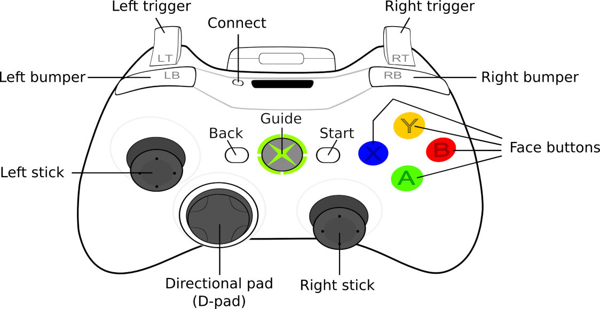

Controls
********

This section describes the controls of the Gaia Sky.

Keyboard controls
=================

To check the most up-to-date controls go to the ``Controls`` tab in the
preferences window. Here are the default keyboard controls.

+------------------------------------+---------------------------------------------------+
| Key(s)                             | Action                                            |
+====================================+===================================================+
| ``NUMPAD 0``                       | Free camera                                       |
+------------------------------------+---------------------------------------------------+
| ``NUMPAD 1``                       | Focus camera                                      |
+------------------------------------+---------------------------------------------------+
| ``NUMPAD 2``                       | Gaia FoV 1 camera                                 |
+------------------------------------+---------------------------------------------------+
| ``NUMPAD 3``                       | Gaia FoV 2 camera                                 |
+------------------------------------+---------------------------------------------------+
| ``NUMPAD 4``                       | Gaia FoV 1 and 2 camera                           |
+------------------------------------+---------------------------------------------------+
| ``SPACE``                          | Toggle simulation play/pause                      |
+------------------------------------+---------------------------------------------------+
| ``F5``                             | Take screenshot                                   |
+------------------------------------+---------------------------------------------------+
| ``F6``                             | Start/stop frame output mode                      |
+------------------------------------+---------------------------------------------------+
| ``F11``                            | Toggle fullscreen/windowed mode                   |
+------------------------------------+---------------------------------------------------+
| ``L-CTRL`` + ``F``                 | Search dialog                                     |
+------------------------------------+---------------------------------------------------+
| ``ESCAPE``                         | Quit application                                  |
+------------------------------------+---------------------------------------------------+
| ``-``                              | Decrease limiting magnitude                       |
+------------------------------------+---------------------------------------------------+
| ``+``                              | Increase limiting magnitude                       |
+------------------------------------+---------------------------------------------------+
| ``,``                              | Divide time warp by two                           |
+------------------------------------+---------------------------------------------------+
| ``.``                              | Double time warp                                  |
+------------------------------------+---------------------------------------------------+
| ``*``                              | Reset limiting magnitude                          |
+------------------------------------+---------------------------------------------------+
| ``B``                              | Toggle constellation boundaries                   |
+------------------------------------+---------------------------------------------------+
| ``C``                              | Toggle constellation lines                        |
+------------------------------------+---------------------------------------------------+
| ``E``                              | Toggle ecliptic grid                              |
+------------------------------------+---------------------------------------------------+
| ``G``                              | Toggle galactic grid                              |
+------------------------------------+---------------------------------------------------+
| ``L``                              | Toggle labels                                     |
+------------------------------------+---------------------------------------------------+
| ``M``                              | Toggle moons                                      |
+------------------------------------+---------------------------------------------------+
| ``O``                              | Toggle orbits                                     |
+------------------------------------+---------------------------------------------------+
| ``P``                              | Toggle planets                                    |
+------------------------------------+---------------------------------------------------+
| ``Q``                              | Toggle equatorial grid                            |
+------------------------------------+---------------------------------------------------+
| ``S``                              | Toggle stars                                      |
+------------------------------------+---------------------------------------------------+
| ``T``                              | Toggle satellites                                 |
+------------------------------------+---------------------------------------------------+
| ``U``                              | Expand/collapse controls window                   |
+------------------------------------+---------------------------------------------------+
| ``L-CTRL`` + ``U``                 | Toggle UI completely (hide/show user interface)   |
+------------------------------------+---------------------------------------------------+
| ``L-CTRL`` + ``D``                 | Toggle debug info                                 |
+------------------------------------+---------------------------------------------------+
| ``L-CTRL`` + ``S``                 | Toggle stereoscopic mode                          |
+------------------------------------+---------------------------------------------------+
| ``L-CTRL`` + ``L-SHIFT`` + ``S``   | Switch between stereoscopic profiles              |
+------------------------------------+---------------------------------------------------+

Mouse controls
==============

Here are the default mouse controls.

+----------------------------------------+-----------------------------------------------------------------+
| Mouse + keys                           | Action                                                          |
+========================================+=================================================================+
| ``L-MOUSE DOUBLE CLICK``               | Select object as focus                                          |
+----------------------------------------+-----------------------------------------------------------------+
| ``L-MOUSE`` + ``DRAG``                 | Pitch and yaw (FREE mode) or rotate around foucs (FOCUS mode)   |
+----------------------------------------+-----------------------------------------------------------------+
| ``L-SHIFT`` + ``L-MOUSE`` + ``DRAG``   | Camera roll                                                     |
+----------------------------------------+-----------------------------------------------------------------+
| ``R-MOUSE`` + ``DRAG``                 | Deviate camera line of sight from focus                         |
+----------------------------------------+-----------------------------------------------------------------+
| ``M-MOUSE`` + ``DRAG`` or ``WHEEL``    | Forward/backward movement                                       |
+----------------------------------------+-----------------------------------------------------------------+

Gamepad controls
----------------

As of version ``0.704b`` the Gaia Sandbox supports basic
gamepad/controller input. By default, only the **Xbox 360 controller**
is supported, so you may want to map your gamepad differently using
software like
```jstest-gtk`` <http://pingus.seul.org/~grumbel/jstest-gtk/>`__ on
Linux or the
```Universal Joystick Remapper`` <https://github.com/evilC/AHK-Universal-Joystick-Remapper>`__
for Windows. You can also opt for a Joystick-to-keyboard solution such
as ```xpadder`` <http://www.xpadder.com/>`__, even though this has not
been tested with Gaia Sky.



   Xbox 360 controller button configuration
The actions mapped to each button or axis depend on the current camera
mode (focus, free, spacecraft):

Focus mode
----------

+------------------------------+-----------------------------------------+
| Axis/button                  | Action                                  |
+==============================+=========================================+
| ``Left bumper``              | Hold to apply ``0.5`` factor to speed   |
+------------------------------+-----------------------------------------+
| ``Right bumper``             | Hold to apply ``0.1`` factor to speed   |
+------------------------------+-----------------------------------------+
| ``Left trigger``             | Move away from focus                    |
+------------------------------+-----------------------------------------+
| ``Right trigger``            | Move towards focus                      |
+------------------------------+-----------------------------------------+
| ``Left stick horizontal``    | Horizontal rotation around focus        |
+------------------------------+-----------------------------------------+
| ``Left stick vertical``      | Vertical rotation around focus          |
+------------------------------+-----------------------------------------+
| ``Right stick horizontal``   | Roll right and left                     |
+------------------------------+-----------------------------------------+
| ``Right stick vertical``     | Move towards or away from focus         |
+------------------------------+-----------------------------------------+
| ``D-pad``                    | None                                    |
+------------------------------+-----------------------------------------+
| ``A``                        | None                                    |
+------------------------------+-----------------------------------------+
| ``B``                        | None                                    |
+------------------------------+-----------------------------------------+
| ``X``                        | None                                    |
+------------------------------+-----------------------------------------+
| ``Y``                        | None                                    |
+------------------------------+-----------------------------------------+

Free camera mode
----------------

+------------------------------+-----------------------------------------+
| Axis/button                  | Action                                  |
+==============================+=========================================+
| ``Left bumper``              | Hold to apply ``0.5`` factor to speed   |
+------------------------------+-----------------------------------------+
| ``Right bumper``             | Hold to apply ``0.1`` factor to speed   |
+------------------------------+-----------------------------------------+
| ``Left trigger``             | Move away from focus                    |
+------------------------------+-----------------------------------------+
| ``Right trigger``            | Move towards focus                      |
+------------------------------+-----------------------------------------+
| ``Left stick horizontal``    | Yaw right and left                      |
+------------------------------+-----------------------------------------+
| ``Left stick vertical``      | Pitch up and down                       |
+------------------------------+-----------------------------------------+
| ``Right stick horizontal``   | Move sideways                           |
+------------------------------+-----------------------------------------+
| ``Right stick vertical``     | Move forward and backward               |
+------------------------------+-----------------------------------------+
| ``D-pad``                    | None                                    |
+------------------------------+-----------------------------------------+
| ``A``                        | None                                    |
+------------------------------+-----------------------------------------+
| ``B``                        | None                                    |
+------------------------------+-----------------------------------------+
| ``X``                        | None                                    |
+------------------------------+-----------------------------------------+
| ``Y``                        | None                                    |
+------------------------------+-----------------------------------------+

Spacecraft mode
---------------

+------------------------------+----------------------------------+
| Axis/button                  | Action                           |
+==============================+==================================+
| ``Left bumper``              | Stabilise spacecraft rotations   |
+------------------------------+----------------------------------+
| ``Right bumper``             | Stop spacecraft                  |
+------------------------------+----------------------------------+
| ``Left trigger``             | Apply backward thrust            |
+------------------------------+----------------------------------+
| ``Right trigger``            | Apply forward thrust             |
+------------------------------+----------------------------------+
| ``Left stick horizontal``    | Yaw right and left               |
+------------------------------+----------------------------------+
| ``Left stick vertical``      | Pitch up and down                |
+------------------------------+----------------------------------+
| ``Right stick horizontal``   | Roll right and left              |
+------------------------------+----------------------------------+
| ``Right stick vertical``     | None                             |
+------------------------------+----------------------------------+
| ``D-pad``                    | None                             |
+------------------------------+----------------------------------+
| ``A``                        | Decrease engine power            |
+------------------------------+----------------------------------+
| ``B``                        | None                             |
+------------------------------+----------------------------------+
| ``X``                        | Increase engine power            |
+------------------------------+----------------------------------+
| ``Y``                        | None                             |
+------------------------------+----------------------------------+

Touch controls
==============

No mobile version yet.
