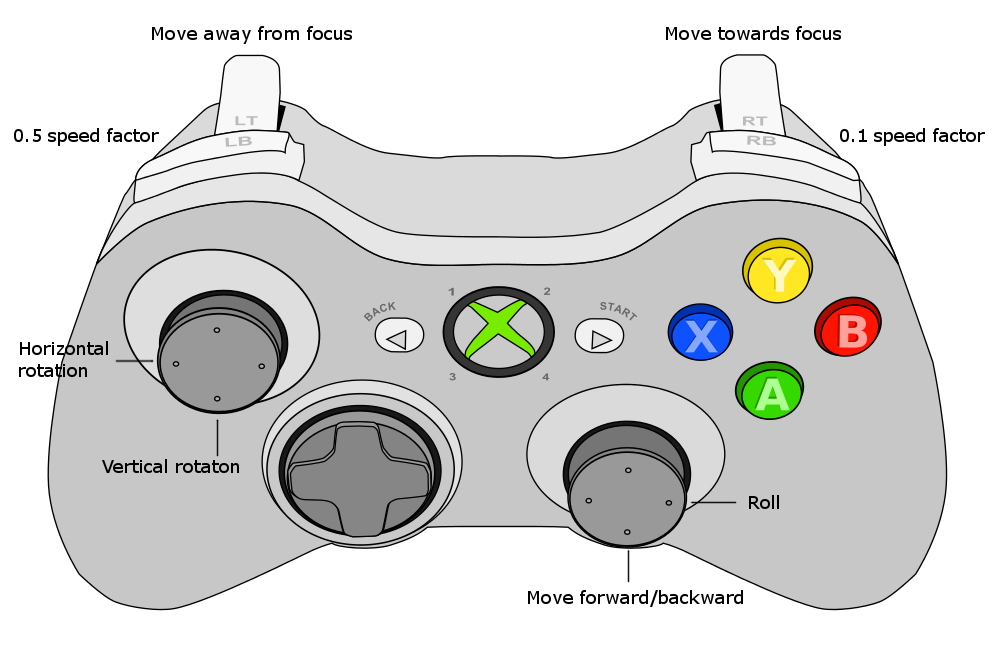

Controls
********

This section describes the controls of Gaia Sky.

Keyboard controls
=================

To check the most up-to-date controls go to the ``Controls`` tab in the
preferences window. Here are the default keyboard controls depending on the
current camera mode. Learn more about camera modes in the :ref:`camera-modes` section.

.. _keyboard-focus-free-mode:

Focus and free camera modes
---------------------------

These keyboard controls apply to the focus mode and also to the free mode.

+------------------------------------+---------------------------------------------------+
| Key(s)                             | Action                                            |
+====================================+===================================================+
| ``ARROW_UP``                       | Camera forward                                    |
+------------------------------------+---------------------------------------------------+
| ``ARROW_DOWN``                     | Camera backward                                   |
+------------------------------------+---------------------------------------------------+
| ``ARROW_RIGHT``                    | Rotate/yaw right                                  |
+------------------------------------+---------------------------------------------------+
| ``ARROW_LEFT``                     | Rotate/yaw left                                   |
+------------------------------------+---------------------------------------------------+
| ``HOME``                           | Back to Earth                                     |
+------------------------------------+---------------------------------------------------+
| ``TAB``                            | Toggle minimap                                    |
+------------------------------------+---------------------------------------------------+
| ``NUMPAD_0`` or ``0``              | Free camera                                       |
+------------------------------------+---------------------------------------------------+
| ``NUMPAD_1`` or ``1``              | Focus camera                                      |
+------------------------------------+---------------------------------------------------+
| ``NUMPAD_2`` or ``2``              | Gaia scene camera                                 |
+------------------------------------+---------------------------------------------------+
| ``NUMPAD_3`` or ``3``              | Spacecraft mode                                   |
+------------------------------------+---------------------------------------------------+
| ``NUMPAD_4`` or ``4``              | Gaia FoV 1 camera                                 |
+------------------------------------+---------------------------------------------------+
| ``NUMPAD_5`` or ``5``              | Gaia FoV 2 camera                                 |
+------------------------------------+---------------------------------------------------+
| ``NUMPAD_6`` or ``6``              | Gaia FoV 1 and 2 camera                           |
+------------------------------------+---------------------------------------------------+
| ``L-CTRL`` + ``3``                 | 360 mode                                          |
+------------------------------------+---------------------------------------------------+
| ``L-CTRL`` + ``L-SHIFT`` + ``UP``  | Increase star point size                          |
+------------------------------------+---------------------------------------------------+
| ``L-CTRL`` + ``L-SHIFT`` + ``DOWN``| Decrease star point size                          |
+------------------------------------+---------------------------------------------------+
| ``SPACE``                          | Toggle simulation play/pause                      |
+------------------------------------+---------------------------------------------------+
| ``F1``                             | Help dialog                                       |
+------------------------------------+---------------------------------------------------+
| ``F5``                             | Take screenshot                                   |
+------------------------------------+---------------------------------------------------+
| ``F6``                             | Start/stop frame output mode                      |
+------------------------------------+---------------------------------------------------+
| ``F11``                            | Toggle fullscreen/windowed mode                   |
+------------------------------------+---------------------------------------------------+
| ``L-CTRL`` + ``F``                 | Search dialog                                     |
+------------------------------------+---------------------------------------------------+
| ``ESCAPE``                         | Quit application                                  |
+------------------------------------+---------------------------------------------------+
| ``-``                              | Decrease limiting magnitude                       |
+------------------------------------+---------------------------------------------------+
| ``+``                              | Increase limiting magnitude                       |
+------------------------------------+---------------------------------------------------+
| ``,``                              | Divide time warp by two                           |
+------------------------------------+---------------------------------------------------+
| ``.``                              | Double time warp                                  |
+------------------------------------+---------------------------------------------------+
| ``*``                              | Reset limiting magnitude                          |
+------------------------------------+---------------------------------------------------+
| ``L-SHIFT`` + ``B``                | Toggle constellation boundaries                   |
+------------------------------------+---------------------------------------------------+
| ``L-SHIFT`` + ``C``                | Toggle constellation lines                        |
+------------------------------------+---------------------------------------------------+
| ``L-SHIFT`` + ``E``                | Toggle ecliptic grid                              |
+------------------------------------+---------------------------------------------------+
| ``L-SHIFT`` + ``G``                | Toggle galactic grid                              |
+------------------------------------+---------------------------------------------------+
| ``L-SHIFT`` + ``L``                | Toggle labels                                     |
+------------------------------------+---------------------------------------------------+
| ``L-SHIFT`` + ``M``                | Toggle moons                                      |
+------------------------------------+---------------------------------------------------+
| ``L-SHIFT`` + ``O``                | Toggle orbits                                     |
+------------------------------------+---------------------------------------------------+
| ``L-SHIFT`` + ``P``                | Toggle planets                                    |
+------------------------------------+---------------------------------------------------+
| ``L-SHIFT`` + ``Q``                | Toggle equatorial grid                            |
+------------------------------------+---------------------------------------------------+
| ``L-SHIFT`` + ``S``                | Toggle stars                                      |
+------------------------------------+---------------------------------------------------+
| ``L-SHIFT`` + ``T``                | Toggle satellites                                 |
+------------------------------------+---------------------------------------------------+
| ``L-SHIFT`` + ``V``                | Toggle star clusters                              |
+------------------------------------+---------------------------------------------------+
| ``L-SHIFT`` + ``H``                | Toggle meshes                                     |
+------------------------------------+---------------------------------------------------+
| ``L-SHIFT`` + ``U``                | Expand/collapse controls window                   |
+------------------------------------+---------------------------------------------------+
| ``L-CTRL`` + ``U``                 | Toggle UI completely (hide/show user interface)   |
+------------------------------------+---------------------------------------------------+
| ``L-CTRL`` + ``D``                 | Toggle debug info                                 |
+------------------------------------+---------------------------------------------------+
| ``L-CTRL`` + ``S``                 | Toggle stereoscopic mode                          |
+------------------------------------+---------------------------------------------------+
| ``L-CTRL`` + ``L-SHIFT`` + ``S``   | Switch between stereoscopic profiles              |
+------------------------------------+---------------------------------------------------+
| ``L-CTRL`` + ``K``                 | Toggle 360 panorama mode                          |
+------------------------------------+---------------------------------------------------+
| ``L-CTRL`` + ``L-SHIFT`` + ``K``   | Switch between 360 projections                     |
+------------------------------------+---------------------------------------------------+
| ``L-CTRL`` + ``L-SHIFT`` + ``G``   | Toggle galaxy renderer                            |
+------------------------------------+---------------------------------------------------+

.. _keyboard-spacecraft-mode:

Spacecraft mode
---------------

These controls apply only to the spacecraft mode.

+------------------------------------+---------------------------------------------------+
| Key(s)                             | Action                                            |
+====================================+===================================================+
| ``W``                              | Apply forward thrust                              |
+------------------------------------+---------------------------------------------------+
| ``S``                              | Apply backward thrust                             |
+------------------------------------+---------------------------------------------------+
| ``A``                              | Roll to the left                                  |
+------------------------------------+---------------------------------------------------+
| ``D``                              | Roll to the right                                 |
+------------------------------------+---------------------------------------------------+
| ``ARROW_UP``                       | Decrease pitch angle                              |
+------------------------------------+---------------------------------------------------+
| ``ARROW_DOWN``                     | Increase pitch angle                              |
+------------------------------------+---------------------------------------------------+
| ``ARROW_LEFT``                     | Increase yaw angle                                |
+------------------------------------+---------------------------------------------------+
| ``ARROW_RIGHT``                    | Decrease yaw angle                                |
+------------------------------------+---------------------------------------------------+
| ``PAGE_UP``                        | Increase engine power by a factor of 10           |
+------------------------------------+---------------------------------------------------+
| ``PAGE_DOWN``                      | Decrease engine power by a factor of 10           |
+------------------------------------+---------------------------------------------------+

.. _mouse-controls:

Mouse controls
==============

Here are the default mouse controls for the focus and free :ref:`camera-modes`. The other modes do not have mouse controls.

.. _mouse-focus-mode:

Focus mode
----------

+----------------------------------------+-----------------------------------------------------------------+
| Mouse + keys                           | Action                                                          |
+========================================+=================================================================+
| ``L-MOUSE DOUBLE CLICK``               | Select focus object                                             |
+----------------------------------------+-----------------------------------------------------------------+
| ``L-MOUSE SINGLE CLICK``               | Stop all rotation and translation movement                      |
+----------------------------------------+-----------------------------------------------------------------+
| ``L-MOUSE`` + ``DRAG``                 | Apply rotation around focus                                     |
+----------------------------------------+-----------------------------------------------------------------+
| ``L-MOUSE`` + ``L-SHIFT`` + ``DRAG``   | Camera roll                                                     |
+----------------------------------------+-----------------------------------------------------------------+
| ``R-MOUSE`` + ``DRAG``                 | Pan view freely from focus                                      |
+----------------------------------------+-----------------------------------------------------------------+
| ``M-MOUSE`` + ``DRAG`` or ``WHEEL``    | Move towards/away from focus                                    |
+----------------------------------------+-----------------------------------------------------------------+

.. _mouse-free-mode:

Free mode
---------

+----------------------------------------+-----------------------------------------------------------------+
| Mouse + keys                           | Action                                                          |
+========================================+=================================================================+
| ``L-MOUSE DOUBLE CLICK``               | Select object as focus (changes to focus mode)                  |
+----------------------------------------+-----------------------------------------------------------------+
| ``L-MOUSE SINGLE CLICK``               | Stop all rotation and translation movement                      |
+----------------------------------------+-----------------------------------------------------------------+
| ``L-MOUSE`` + ``DRAG``                 | Pan view                                                        |
+----------------------------------------+-----------------------------------------------------------------+
| ``L-MOUSE`` + ``L-SHIFT`` + ``DRAG``   | Camera roll                                                     |
+----------------------------------------+-----------------------------------------------------------------+
| ``M-MOUSE`` + ``DRAG`` or ``WHEEL``    | Forward/backward movement                                       |
+----------------------------------------+-----------------------------------------------------------------+

Gamepad controls
================

Gaia Sky supports (as of version ``1.5.0``) mappings for different controller types.
However, so far only the mappings files for the **Xbox 360 controller** and the **PS3 controller** are provided. 

Sometimes there are differences between the axes and buttons codes for the same controller device between operating systems. To solve
this issue, we offer a way to describe operating system specific mappings. To do so, create a new mappings file with the format
``[controller_name].[os_family].controller``, where ``os_family`` is ``linux``, ``win``, ``macos``, ``unix`` or ``solaris``. If the
mappings for the given file name and OS family are found, they will be used. Otherwise, the file defined in the configuration file is used.
For example, if we have the file ``xbox360.controller`` is defined in the configuration file, the system will look up ``xbox360.win.controller`` if on Windows, 
``xbox360.linux.controller`` if on Linux, and so on. If found, the file is used. Otherwise, the default ``xbox360.controller`` file is used. Gaia Sky
provides the default ``xbox360.controller`` file, which defines the Linux mappings, and also the Windows mappings ``xbox360.win.controller``.

The mappings files (see `here <https://github.com/langurmonkey/gaiasky/blob/master/assets/mappings/xbox360.controller>`__)
must be in the ``$GS_INSTALL_LOCATION/mappings`` or in the ``$HOME/.gaiasky/mappings`` folder, and basically assign the button and axis codes for the particular
controller to the actions.

.. code:: 

	# AXES
	
	axis.roll=3
	axis.pitch=1
	axis.yaw=0
	axis.move=4
	axis.velocityup=5
	axis.velocitydown=2
	
	# BUTTONS
	
	button.velocityup=2
	button.velocitydown=0
	button.velocitytenth=5
	button.velocityhalf=4

The actions depend on the current camera
mode (focus, free, spacecraft), and are described below.

Creating mappings files for new controllers
-------------------------------------------

As of version ``1.5.1`` a new controller debug mode has been added to help **create new mappings files**. This mode prints to the log all key press and release events with their respective key codes, as well as trigger events, values and codes. It also prints controller connection and disconnection events.

In order to enable the controller debug mode, set the property ``controls.debugmode=true`` in the ``$HOME/.gaiasky/global.properties`` file.

Put your new files in ``$GS_INSTALL_LOCATION/mappings/`` or ``$HOME/.gaiasky/mappings/``. The name of the file should be ``[controller brand and model].mappings``. For example, ``xboxone.mappings`` or ``logitech_f310.mappings``.

Please, if you create mappings files for new game controllers, create a pull request in the `gaiasky github <https://github.com/langurmonkey/gaiasky/pulls>`__ so that the community can benefit.

.. _gamepad-focus-mode:

Focus mode
----------

   Xbox 360 controller in focus mode

+------------------------------+-----------------------------------------+
| Property                     | Action                                  |
+==============================+=========================================+
| ``button.velocityhalf``      | Hold to apply ``0.5`` factor to speed   |
+------------------------------+-----------------------------------------+
| ``button.velocitytenth``     | Hold to apply ``0.1`` factor to speed   |
+------------------------------+-----------------------------------------+
| ``axis.velocitydown``        | Move away from focus                    |
+------------------------------+-----------------------------------------+
| ``axis.velocityup``          | Move towards focus                      |
+------------------------------+-----------------------------------------+
| ``axis.yaw``                 | Horizontal rotation around focus        |
+------------------------------+-----------------------------------------+
| ``axis.pitch``               | Vertical rotation around focus          |
+------------------------------+-----------------------------------------+
| ``axis.roll``                | Roll right and left                     |
+------------------------------+-----------------------------------------+
| ``axis.move``                | Move towards or away from focus         |
+------------------------------+-----------------------------------------+
| ``button.velocityup``        | Move towards focus                      |
+------------------------------+-----------------------------------------+
| ``button.velocitydown``      | Move away from focus                    |
+------------------------------+-----------------------------------------+

.. _gamepad-free-mode:

Free camera mode
----------------

+------------------------------+-----------------------------------------+
| Axis/button                  | Action                                  |
+==============================+=========================================+
| ``button.velocityhalf``      | Hold to apply ``0.5`` factor to speed   |
+------------------------------+-----------------------------------------+
| ``button.velocitytenth``     | Hold to apply ``0.1`` factor to speed   |
+------------------------------+-----------------------------------------+
| ``axis.velocitydown``        | Move away from focus                    |
+------------------------------+-----------------------------------------+
| ``axis.velocityup``          | Move towards focus                      |
+------------------------------+-----------------------------------------+
| ``axis.yaw``                 | Yaw right and left                      |
+------------------------------+-----------------------------------------+
| ``axis.pitch``               | Pitch up and down                       |
+------------------------------+-----------------------------------------+
| ``axis.roll``                | Move sideways                           |
+------------------------------+-----------------------------------------+
| ``axis.move``                | Move forward and backward               |
+------------------------------+-----------------------------------------+
| ``button.velocityup``        | Move towards focus                      |
+------------------------------+-----------------------------------------+
| ``button.velocitydown``      | Move away from focus                    |
+------------------------------+-----------------------------------------+

.. _gamepad-spacecraft-mode:

Spacecraft mode
---------------

+------------------------------+----------------------------------+
| Axis/button                  | Action                           |
+==============================+==================================+
| ``button.velocityhalf``      | Stabilise spacecraft rotations   |
+------------------------------+----------------------------------+
| ``button.velocitytenth``     | Stop spacecraft                  |
+------------------------------+----------------------------------+
| ``axis.velocitydown``        | Apply backward thrust            |
+------------------------------+----------------------------------+
| ``axis.velocityup``          | Apply forward thrust             |
+------------------------------+----------------------------------+
| ``axis.yaw``                 | Yaw right and left               |
+------------------------------+----------------------------------+
| ``axis.pitch``               | Pitch up and down                |
+------------------------------+----------------------------------+
| ``axis.roll``                | Roll right and left              |
+------------------------------+----------------------------------+
| ``axis.move``                | None                             |               
+------------------------------+----------------------------------+
| ``button.velocityup``        | Increase engine power            |
+------------------------------+----------------------------------+
| ``button.velocitydown``      | Decrease engine power            |
+------------------------------+----------------------------------+

Touch controls
==============

No mobile version yet.
