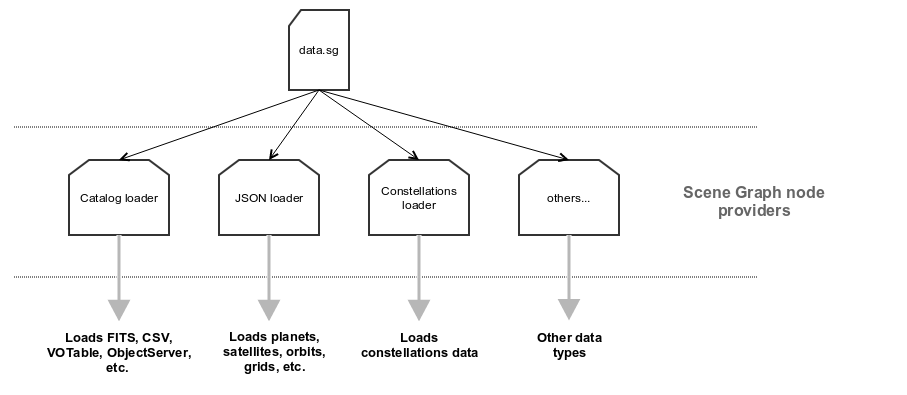

Data: catalogues and formats
****************************

Gaia Sky needs to first load data in order to display it. The internal
structure of these data is a ``scenegraph``, which is basically a **tree
with nodes**. The objects that are displayed in a scene are all nodes in
this scene graph and are organized in a hierarchical manner depending on
their geometrical and spatial relations.

.. hint:: The data nodes in the scene graph are of multiple natures and are *loaded differently depending on their type*. Here we can make the first big distinction in the data nodes depending on where they come from.

The different types of data are:

- **Particle data** -- usually stars which come from a star catalogue. In this group we have two different approaches: **single particles** and **particle groups**. The TLDR version says that the **single particles** method is fundamentally slower and CPU-bound, while the **particle groups** method is faster and GPU-based. More on this later.
- **Rest of data** -- planets, orbits, constellations, grids and everything else qualifies for this category.

Data belonging to either group will be loaded differently into the Gaia
Sky. The sections below describe the data format in detail:

.. _general-data-loading:

General information on the data loading mechanisms
==================================================

Gaia Sky uses a flexible data loading mechanism where the
correspondences between data loader and files are defined in a couple of
``JSON`` files which are specified in the ``global.properties``
configuration file in ``$HOME/.gaiasky/``. The two main files are the
catalog file (usually ``data/catalog-*.json``) and the objects file
(``data/data-low.json``, ``data/data-normal.json`` and
``data/data-high.json`` are the default options, which provide the low,
normal and high graphics quality settings). See the :ref:`properties file <properties-file>` section for more information on this.

catalog-\*.json example files
-----------------------------

.. code:: json

    { "data" : [
        {
            "loader": "gaia.cu9.ari.gaiaorbit.data.stars.HYGBinaryLoader",
            "files": [ "data/hygxyz.bin" ]
        }
    ]}

.. code:: json

    { "data" : [
    	{
    		"loader": "gaia.cu9.ari.gaiaorbit.data.stars.OctreeCatalogLoader",
    		"files": [ "data/octree/tgas_final_particles.bin", "data/octree/tgas_final_metadata.bin" ]
    	}
    ]}

data-\*.json example file
-------------------------

.. code:: json

    { "data" : [
        {
            "loader": "gaia.cu9.ari.gaiaorbit.data.JsonLoader",
            "files": [ "data/planets-normal.json",
                        "data/moons-normal.json",
                        "data/satellites.json",
                        "data/asteroids.json",
                        "data/orbits_planet.json",
                        "data/orbits_moon.json",
                        "data/orbits_asteroid.json",
                        "data/orbits_satellite.json",
                        "data/extra-low.json",
                        "data/locations.json",
                        "data/locations_earth.json",
                        "data/locations_moon.json"]
        },
        {
            "loader": "gaia.cu9.ari.gaiaorbit.data.constel.ConstellationsLoader",
            "files": [ "data/constel_hip.csv" ]
        },
        {
            "loader": "gaia.cu9.ari.gaiaorbit.data.constel.ConstelBoundariesLoader",
            "files": [ "data/boundaries.csv" ]
        }
    ]}

As you see the format in both files is based on specifying ``Java``
``"loader"`` classes that will load the list of files under the
``"files"`` property. The format should be pretty self-explanatory, but
here are some rules:

   Gaia Sky data loading diagram

-  The **"data"** property contains a list of ``Java`` classes that
   implement the
   ``ISceneGraphLoader`` --`here <https://github.com/langurmonkey/gaiasky/blob/master/core/src/gaia/cu9/ari/gaiaorbit/data/ISceneGraphLoader.java>`__--
   interface. Each one of these will load a different kind of data; the
   ``JSONLoader`` --`here <https://github.com/langurmonkey/gaiasky/blob/master/core/src/gaia/cu9/ari/gaiaorbit/data/JsonLoader.java>`__--
   loads non-catalog data (planets, satellites, orbits, etc.), the
   ``STILCatalogLoader`` --`here <https://github.com/langurmonkey/gaiasky/blob/master/desktop/src/gaia/cu9/ari/gaiaorbit/data/stars/STILCatalogLoader.java>`__--
   loads ``VOTables``, ``FITS``, ``CSV`` and other files through the
   `STIL <http://www.star.bristol.ac.uk/~mbt/stil/>`__ library,
   ``ConstellationsLoader`` --`here <https://github.com/langurmonkey/gaiasky/blob/master/core/src/gaia/cu9/ari/gaiaorbit/data/constel/ConstellationsLoader.java>`__--
   and
   ``ConstellationsBoundariesLoader`` --`here <https://github.com/langurmonkey/gaiasky/blob/master/core/src/gaia/cu9/ari/gaiaorbit/data/constel/ConstelBoundariesLoader.java>`__--
   load constellation data and constellation boundary data respectively
   and so on.
-  Then, for each one of these data loaders a **list of files** is
   defined. This list will be passed to the loader, which will try to
   load these files and add them to the scene graph.

Particle data
=============

Particle data refers to the loading of particles (stars, galaxies, etc.) where each gets an object
in the internal scene graph model. This allows for selection, labeling, levels of detail, etc.

There are several off-the-shelf options to get local data in various formats
into Gaia Sky. 

In order to load **local data** there are a series of default options
which can be combined. As described in the :ref:`general data loading <general-data-loading>` section,
multiple catalogue loaders can be used at once. Each catalog loader will
get a list of files to load. A description of the main local catalog
loaders follows.

Particle groups
---------------

As of version ``1.5.0``, Gaia Sky offers a new data type, the particle group. Particle groups can be either point particles or stars (defined by star groups).
Particle data are read from a file using a certain particle/star group provider implementation, and these data
are sent to GPU memory where they reside. This approach allows for these objects to be composed of hundreds of
thousands of particles and still have a minimal impact on performance.

Let's see an example of the definition of one of such particle groups in the Oort cloud:

.. code:: json

	{
		"name" : "Oort cloud",
		"position" : [0.0, 0.0, 0.0],
		// Color of particles
		"color" : [0.9, 0.9, 0.9, 0.8],
		// Size of particles
		"size" : 2.0,
		"labelcolor" : [0.3, 0.6, 1.0, 1.0],
		// Position in parsecs
		"labelposition" : [0.0484814, 0.0, 0.0484814]
		"ct" : Others,
	
		// Fade distances, in parsecs
		"fadein" : [0.0004, 0.004],
		"fadeout" : [0.1, 15.0],
		
		"profiledecay" : 1.0,
		
	
		"parent" : "Universe", 
		"impl" : "gaia.cu9.ari.gaiaorbit.scenegraph.ParticleGroup",
		
		// Extends IParticleGroupDataProvider
		"provider" : "gaia.cu9.ari.gaiaorbit.data.group.PointDataProvider",
		"factor" :  149.597871,
		"datafile" : "data/oort/oort_10000particles.dat"	
	}

Let's go over the attributes:

-  ``name`` -- The name of the particle group.
-  ``position`` -- The mean cartesian position (see :ref:`internal reference system <reference-system>`) in parsecs, used for sorting purposes and also for positioning the label. If this is not provided, the mean position of all the particles is used.
-  ``color`` -- The color of the particles as an ``rgba`` array.
-  ``size``  -- The size of the particles. In a non HiDPI screen, this is in pixel units. In HiDPI screens, the size will be scaled up to maintain the proportions.
-  ``labelcolor``  -- The color of the label as an ``rgba`` array.
-  ``labelposition``  -- The cartesian position (see :ref:`internal reference system <reference-system>`) of the label, in parsecs.
-  ``ct``  -- The ``ComponentType`` --`here <https://github.com/langurmonkey/gaiasky/blob/master/core/src/gaia/cu9/ari/gaiaorbit/render/SceneGraphRenderer.java#L59>`__--. This is basically a ``string`` that will be matched to the entity type in ``ComponentType`` enum. Valid component types are ``Stars``, ``Planets``, ``Moons``, ``Satellites``, ``Atmospheres``, ``Constellations``, etc.
-  ``fadein``  -- The fade in inetrpolation distances, in parsecs. If this property is defined, there will be a fade-in effect applied to the particle group between the distance ``fadein[0]`` and the distance ``fadein[1]``.
-  ``fadeout``  -- The fade out inetrpolation distances, in parsecs. If this property is defined, there will be a fade-in effect applied to the particle group between the distance ``fadein[0]`` and the distance ``fadein[1]``.
-  ``profiledecay``  -- This attribute controls how particles are rendered. This is basically the opacity profile decay of each particle, as in ``(1.0 - dist)^profiledecay``, where dist is the distance from the center (center dist is 0, edge dist is 1).
-  ``parent``  -- The name of the parent object in the scenegraph.
-  ``impl``  -- The full name of the model class. This should always be ``gaia.cu9.ari.gaiaorbit.scenegraph.ParticleGroup``.
-  ``provider``  -- The full name of the data provider class. This must extend ``gaia.cu9.ari.gaiaorbit.data.group.IParticleGroupDataProvider`` (see `here <https://github.com/langurmonkey/gaiasky/blob/master/core/src/gaia/cu9/ari/gaiaorbit/data/group/IParticleGroupDataProvider.java>`__).
-  ``factor``  -- A factor to be applied to each coordinate of each data point. If not specified, defaults to 1.
-  ``datafile``  -- The actual file with the data. It must be in a format that the data provider specified in ``provider`` knows how to load.

Single particles
----------------

This approach creates a model object for every single star or particle. Also, these model objects are 
inserted into the scene graph and updated every loop cycle. This means that as the number of particles grow, the
impact on performance will also grow (linearly or not, depending on the multithreading setting). This method is
discouraged for very large catalogs (+1M objects) because it will inevitably produce low frame rates.
By combining single particles into a levels of detail structure (i.e. an octree), we can deal and explore huge datasets, as described below.
Let's see what loaders are available for the single particles approach.

HYG catalog loaders
~~~~~~~~~~~~~~~~~~~

These loaders
(``HYGBinaryLoader`` --`here <https://github.com/langurmonkey/gaiasky/blob/master/core/src/gaia/cu9/ari/gaiaorbit/data/stars/HYGBinaryLoader.java>`__--
and
``HYGCSVLoader`` --`here <https://github.com/langurmonkey/gaiasky/blob/master/core/src/gaia/cu9/ari/gaiaorbit/data/stars/HYGCSVLoader.java>`__--)
load the HYG catalog that comes bundled with the Gaia Sky, which may
be in ``csv`` format or in an arbitrary (not standard) binary --``bin``--
format. Even though they have the ``HYG-`` prefix, these can load any
file in the same format. The ``csv`` and ``bin`` formats are described
below.

- **CSV format**: This is the ``csv`` format as downloaded
from the `HYG Database site <http://www.astronexus.com/hyg>`__. The
first line contains the headers and is skipped. Then, each following row
contains a particle (star) with the following columns:

+---------------------------------+-------------------+------------+-----------+
| Name                            | Data type         | Optional   | Ignored   |
+=================================+===================+============+===========+
| Star ID (pk)                    | ``long``          | no         | no        |
+---------------------------------+-------------------+------------+-----------+
| Hipparcos catalog id            | ``long``          | yes        | no        |
+---------------------------------+-------------------+------------+-----------+
| Henry Draper catalog id         | ``long``          | yes        | yes       |
+---------------------------------+-------------------+------------+-----------+
| Harvard Revised catalog id      | ``long``          | yes        | yes       |
+---------------------------------+-------------------+------------+-----------+
| Gliese catalog id               | ``string``        | yes        | yes       |
+---------------------------------+-------------------+------------+-----------+
| Bayer / Flamsteed designation   | ``string``        | yes        | no        |
+---------------------------------+-------------------+------------+-----------+
| Proper name                     | ``string``        | yes        | no        |
+---------------------------------+-------------------+------------+-----------+
| Right ascension                 | ``float`` [deg]   | no         | no        |
+---------------------------------+-------------------+------------+-----------+
| Declination                     | ``float`` [deg]   | no         | no        |
+---------------------------------+-------------------+------------+-----------+
| Distance                        | ``float`` [pc]    | no         | no        |
+---------------------------------+-------------------+------------+-----------+
| Magnitude                       | ``float`` [mag]   | no         | no        |
+---------------------------------+-------------------+------------+-----------+
| Absolute magnitude              | ``float`` [mag]   | yes        | no        |
+---------------------------------+-------------------+------------+-----------+
| Spectrum type                   | ``string``        | no         | yes       |
+---------------------------------+-------------------+------------+-----------+
| Color index                     | ``float``         | no         | no        |
+---------------------------------+-------------------+------------+-----------+

-  **BIN format**: The binary format is described in the class comment of ``HYGBinaryLoader`` --`here <https://github.com/langurmonkey/gaiasky/blob/master/core/src/gaia/cu9/ari/gaiaorbit/data/stars/HYGBinaryLoader.java>`__--. The meaning of each single bit in this format is described below:

   -  **32 bits (int)** -- The number of stars in the file, ``starNum`` repeat the following ``starNum`` times (for each star)
   -  **32 bits (int)** -- The the length of the name, or ``nameLength``
   -  **16 bits \* ``nameLength`` (chars)** -- The name of the star
   -  **32 bits (float)** -- Apparent magnitude
   -  **32 bits (float)** -- Absolute magnitude
   -  **32 bits (float)** -- Color index B-V
   -  **32 bits (float)** -- Right ascension [deg]
   -  **32 bits (float)** -- Declination [deg]
   -  **32 bits (float)** -- Distance [pc \* 3.0856775204864006E7]
   -  **64 bits (long)** -- Star identifier

   There is a utility to convert the ``csv`` catalog to the ``bin`` format. It is called ``HYGToBinary`` --`here <https://github.com/langurmonkey/gaiasky/blob/master/desktop/src/gaia/cu9/ari/gaiaorbit/data/HYGToBinary.java>`__-- and it can easily be adapted to convert any supported format to this binary format.

Legacy octree catalog loader (single file)
~~~~~~~~~~~~~~~~~~~~~~~~~~~~~~~~~~~~~~~~~~

This is practically the same format as the binary in the
``HYGBinaryLoader`` but adding some metadata to construct an
`octree <http://en.wikipedia.org/wiki/Octree>`__ in order to cull
portions of the catalog that are not visible and to implement a
level-of-detail system to reduce the amount of particles in the
viewport. 
This loader is called ``OctreeSingleFileLoader`` and is implemented `here <https://github.com/langurmonkey/gaiasky/blob/master/core/src/gaia/cu9/ari/gaiaorbit/data/stars/OctreeSingleFileLoader.java>`__. 

This loader needs two files, the **particles file** and the
**metadata** file. Both files are binary files and their description is
below.

- **Particles file**: The actual reading and writing of the particles file is done in the ``ParticleDataBinaryIO`` --`here <https://github.com/langurmonkey/gaiasky/blob/master/core/src/gaia/cu9/ari/gaiaorbit/data/octreegen/ParticleDataBinaryIO.java>`__--. The format is exactly the same as in the HYG ``bin`` format but adding two extra attributes to each star which indicate the ``pageId`` (the identifier of the octant) and the ``particleType``, an integer code indicating whether it is a real star or a virtual particle created for a higher LoD (level of detail).

    - **32 bits (int)** -- The number of stars in the file, `starNum` repeat the following `starNum` times (for each star)
    - **32 bits (int)** -- The the length of the name, or `nameLength`
    - **16 bits * `nameLength` (chars)** -- The name of the star
    - **32 bits (float)** -- Apparent magnitude
    - **32 bits (float)** -- Absolute magnitude
    - **32 bits (float)** -- Color index B-V
    - **32 bits (float)** -- Right ascension [deg]
    - **32 bits (float)** -- Declination [deg]
    - **32 bits (float)** -- Distance [pc * 3.0856775204864006E7]
    - **64 bits (long)** -- Star identifier
    - **64 bits (long)** -- Page id
    - **32 bits (int)** -- Particle type

-  **Metadata file**: This file contains the information of the Octree,
   its nodes -octants- and the particles each node contains. The reading
   and writing is handled by the
   ``MetadataBinaryIO`` --`here <https://github.com/langurmonkey/gaiasky/blob/master/core/src/gaia/cu9/ari/gaiaorbit/data/octreegen/MetadataBinaryIO.java>`__--.
   The format is as follows:

   -  **32 bits (int)** with the number of nodes, ``nNodes`` repeat the following ``nNodes`` times (for each node)
   -  **64 bits (long)** -- ``pageId`` - The page id
   -  **64 bits (double)** -- ``centreX`` - The x component of the centre
   -  **64 bits (double)** -- ``centreY`` - The y component of the centre
   -  **64 bits (double)** -- ``centreZ`` - The z component of the centre
   -  **64 bits (double)** -- ``sx`` - The size in x
   -  **64 bits (double)** -- ``sy`` - The size in y
   -  **64 bits (double)** -- ``sz`` - The size in z
   -  **64 bits \* 8 (long)** -- ``childrenIds`` - 8 longs with the ids
      of the children. If no child in the given position, the id is
      negative.
   -  **32 bits (int)** -- ``depth`` - The depth of the node
   -  **32 bits (int)** -- ``nObjects`` - The number of objects of this
      node and its descendants
   -  **32 bits (int)** -- ``ownObjects`` - The number of objects of this
      node
   -  **32 bits (int)** -- ``childCount`` - The number of children nodes

In order to produce these files from a catalog, one needs to
``OctreeGenerator`` --`here <https://github.com/langurmonkey/gaiasky/blob/master/core/src/gaia/cu9/ari/gaiaorbit/data/octreegen/OctreeGenerator.java>`__--.
This class will get a list of stars and will produce the Octree
according to certain parameters. The class
``OctreeGeneratorTest`` --`here <https://github.com/langurmonkey/gaiasky/blob/master/desktop/src/gaia/cu9/ari/gaiaorbit/data/OctreeGeneratorTest.java>`__--
may be used to read a catalog from a file, generate the octree and write
both the particles and the metadata files back to a file.

Octree catalog loader (multifile)
~~~~~~~~~~~~~~~~~~~~~~~~~~~~~~~~~

As of version ``1.5.0``, a new on-demand catalog loader exists, called Octree multifile loader. 
This is a version of the octree catalog loader specially designed for very large datasets. This version
does not load everything at startup. It needs the catalog to be organised into several files, each one corresponding to 
a particluar octree node. This is an option in the `OctreeGeneratorTest <https://github.com/langurmonkey/gaiasky/blob/master/desktop/src/gaia/cu9/ari/gaiaorbit/data/OctreeGeneratorTest.java>`__.
Back to the loader, it can pre-load files down to a certain depth level; the rest of the
files will be loaded when needed and unloaded if necessary. This offers a convenient way in which the data is streamed from disk
to the main memory as the user explores the dataset. It also results in a very fast program startup.
This loader is called ``OctreeMultiFileLoader`` and is implemented `here <https://github.com/langurmonkey/gaiasky/blob/master/core/src/gaia/cu9/ari/gaiaorbit/data/stars/OctreeMultiFileLoader.java>`__. 

STIL catalog loader
~~~~~~~~~~~~~~~~~~~

As of version ``v0.704`` the Gaia Sky supports all formats supported
by the ``STIL`` `library <http://www.star.bristol.ac.uk/~mbt/stil/>`__.
Since the data held by the formats supported by ``STIL`` is not of a
unique nature, this catalog loader makes a series of assumptions:

-  Positional information exists in the source file (spherical/cartesian
   equatorial/galactic coordinates are accepted, correspoding to the
   ``ucd``\ s ``pos.eq.*`` and ``pos.galactic.*``, where the ``*`` can
   be ``ra``, ``dec``, ``glat``, ``glon``, ``x``, ``y`` and ``z``).
-  Apparent magnitude data in at least one filter exists
   (``phot.mag;em.opt.*``, where ``*`` can be ``V``, ``B``, ``I`` or
   ``R``).
-  Absolute magnitude data is not required but always welcome
   (``phys.magAbs;em.opt.*``).
-  B-V color index is present (corresponding to the ``ucd``
   ``phot.color;em.opt.B;em.opt.V``). More colors will be supported
   soon.
-  If ``meta.id`` and/or ``meta.id;meta.main`` are present, they are
   used as name and identifier of the stars respectively. Otherwise, a
   random name and identifier are generated and assigned.

Non-particle data: Planets, Moons, Asteroids, etc.
==================================================

Most of the entities and celestial bodies that are not stars in the Gaia
Sky scene are defined in a series of ``json`` files and are loaded
using the
``JsonLoader`` --`here <https://github.com/langurmonkey/gaiasky/blob/master/core/src/gaia/cu9/ari/gaiaorbit/data/JsonLoader.java>`__--.
The format is very flexible and loosely matches the underneath data
model, which is a scene graph tree.

Top-level objects
-----------------

All objects in the ``json`` files must have at least the following 5
properties: - ``name``: The name of the object. - ``color``: The colour
of the object. This will translate to the line colour in orbits, to the
colour of the point for planets when they are far away and to the colour
of the grid in grids.

- ``ct`` -- The ``ComponentType`` --`here <https://github.com/langurmonkey/gaiasky/blob/master/core/src/gaia/cu9/ari/gaiaorbit/render/SceneGraphRenderer.java#L59>`__--. This is basically a ``string`` that will be matched to the entity type in ``ComponentType`` enum. Valid component types are ``Stars``, ``Planets``, ``Moons``, ``Satellites``, ``Atmospheres``, ``Constellations``, etc.
- ``impl`` -- The package and class name of the implementing class. - ``parent``: The name of the parent entity.

Additionally, different types of entities accept different additional
parameters which are matched to the model using reflection. Here are
some examples of these parameters:

-  ``size`` -- The size of the entity, usually the radius in ``km``.
-  ``appmag`` -- The apparent magnitude.
-  ``absmag`` -- The absolute magnitude.

Below is an example of a simple entity, the equatorial grid:

.. code:: json

    {
        "name" : "Equatorial grid",
        "color" : [1.0, 0.0, 0.0, 0.5],
        "size" : 1.2e12,
        "ct" : "Equatorial",

        "parent" : "Universe",
        "impl" : "gaia.cu9.ari.gaiaorbit.scenegraph.Grid"
    }

Planets, moons, asteroids and all rigid bodies
----------------------------------------------

Planets, moons and asteroids all use the model object
``Planet`` -`here <https://github.com/langurmonkey/gaiasky/blob/master/core/src/gaia/cu9/ari/gaiaorbit/scenegraph/Planet.java>`__-.
This provides a series of utilities that make their ``json``
specifications look similar.

Coordinates
~~~~~~~~~~~

Within the ``coordinates`` object one specifies how to get the
positional data of the entity given a time. This object contains a
reference to the implementation class (which must implement
``IBodyCoordinates`` -`here <https://github.com/langurmonkey/gaiasky/blob/master/core/src/gaia/cu9/ari/gaiaorbit/util/coord/IBodyCoordinates.java>`__-)
and the necessary parameters to initialize it. There are currently a
bunch of implementations that can be of use:

-  ``OrbitLintCoordinates`` -- The coordinates of the object are linearly
   interpolated using the data of its orbit, which is defined in a
   separated entity. See the
   [[Orbits\|Non-particle-data-loading#orbits]] section for more info.
   The ``name`` of the orbit entity must be given. For instance, the
   Hygieia moon uses orbit coordinates.

  .. code:: json

      json   "coordinates" : {
        "impl" : "gaia.cu9.ari.gaiaorbit.util.coord.OrbitLintCoordinates",
        "orbitname" : "Hygieia orbit"
      }

- ``StaticCoordinates`` -- For entities that never move. A position is required. For instance, the Milky Way object uses static coordinates:

  .. code:: json

      json   "coordinates" : {
        "impl" : "gaia.cu9.ari.gaiaorbit.util.coord.StaticCoordinates",
        "position" : [-2.1696166830918058e+17, -1.2574136144478805e+17, -1.8981686396725044e+16]
      }

- ``AbstractVSOP87`` -- Used for the major planets, these coordinates

implement the ``VSOP87`` algorithms. Only the implementation is needed.
For instance, the Earth uses these coordinates.

  .. code:: json

      json   "coordinates" : {
        "impl" : "gaia.cu9.ari.gaiaorbit.util.coord.vsop87.EarthVSOP87"
      }

- ``GaiaCoordinates`` -- Special coordinates for Gaia.

- ``MoonAACoordinates`` -- Special coordinates for the moon using the algorithm described in the book Astronomical Algorithms by Jean Meeus.

Rotation
~~~~~~~~

The ``rotation`` object describes, as you may imagine, the rigid
rotation of the body in question. A rotation is described by the
following parameters:

- ``period`` -- The rotation period in hours.
- ``axialtilt`` -- The axial tilt is the angle between the equatorial plane of the body and its orbital plane. In degrees.
- ``inclination`` -- The inclination is the angle between the orbital plane and the ecliptic. In degrees.
- ``ascendingnode`` -- The ascending node in degrees.
- ``meridianangle`` -- The meridian angle in degrees.

For instance, the rotation of Mars:

.. code:: json

    "rotation": {
        // In hours
        "period" : 24.622962156,
        // Angle between equatorial plane and orbital plane
        "axialtilt" : 25.19,
        // Inclination of orbit plane with respect to ecliptic
        "inclination" : 1.850,
        "ascendingnode" : 47.68143,
        "meridianangle" : 176.630
    }

Model
~~~~~

This object describes the model which must be used to represent the
entity. Models can have two origins: - They may come from a **3D model
file**. In this case, you just need to specify the file.

.. code:: json

    json   "model": {
      "args" : [true],
      "model" : "data/models/gaia/gaia.g3db"
    }

-  They may be **generated on the fly**. In this case, you need to
   specify the type of model, a series of parameters and the texture or
   textures.

.. code:: json

    json   "model": {
      "args" : [true],
      "type" : "sphere",
      "params" : {
        "quality" : 180,
        "diameter" : 1.0,
        "flip" : false
        },
      "texture" : {
        "base" : "data/tex/earth.jpg",
        "specular" : "data/tex/earth-specular.jpg",
        "normal" : "data/tex/earth-normal-4k.jpg",
        "night" : "data/tex/earth-night-2k.jpg"
      }
    }

- ``type`` -- The type of model. Possible values are ``sphere``, ``disc``, ``cylinder`` and ``ring``.
- ``params`` -- Parameters of the model. This depends on the type. The ``quality`` is the number of both horizontal and vertical divisions. The ``diameter`` is the diameter of the model and ``flip`` indicates whether the normals should be flipped to face outwards. The ``ring`` type also accepts ``innerradius`` and ``outerradius``.
- ``texture`` -- Indicates the texture or textures to apply. The ``base`` texture is the one applied in normal conditions. The ``specular`` is the specular map to produce specular reflections. The ``normal`` is a normal map to produce extra detail in the lighting. The ``night`` is the texture applied to the part of the model in the shade.

Atmosphere
~~~~~~~~~~

Planet atmospheres can also be defined using this object. The
``atmosphere`` object gets a number of physical quantities that are fed
in the atmospheric scattering algorithm (`Sean O'Neil, GPU
Gems <http://http.developer.nvidia.com/GPUGems2/gpugems2_chapter16.html>`__).

.. code:: json

    "atmosphere" : {
        "size" : 6600.0,
        "wavelengths" : [0.650, 0.570, 0.475],
        "m_Kr" : 0.0025,
        "m_Km" : 0.001,

        "params" : {
            "quality" : 180,
            // Atmosphere diameters are always 2
            "diameter" : 2.0,
            "flip" : true
        }
    }

Orbits
------

When we talk about orbits in this context we talk about orbit lines. In
the Gaia Sky orbit lines may be created from two different sources.
The sources are used by a class implementing the
``IOrbitDataProvider`` --`here <https://github.com/langurmonkey/gaiasky/blob/master/core/src/gaia/cu9/ari/gaiaorbit/data/orbit/IOrbitDataProvider.java>`__--
interface, which is also specified in ther ``orbit`` object.

- An **orbit data file**. In this case, the orbit data provider is ``OrbitFileDataProvider``.
- The **orbital elements**, where the orbit data provider is ``OrbitalParametersProvider``.

If the orbit is pre-sampled it comes from an **orbit data file**. In the
Gaia Sky the orbits of all major planets are pre-sampled, as well as
the orbit of Gaia. For instance, the orbit of **Venus**.

.. code:: json

    {
        "name" : "Venus orbit",
        "color" : [1.0, 1.0, 1.0, 0.55],
        "ct" : "Orbits",

        "parent" : "Sol",
        "impl" : "gaia.cu9.ari.gaiaorbit.scenegraph.Orbit",
        "provider" : "gaia.cu9.ari.gaiaorbit.data.orbit.OrbitFileDataProvider",

        "orbit" : {
            "source" : "data/orb.VENUS.dat",
        }
    }

If you prefer to define the orbit using the `orbital
elements <http://en.wikipedia.org/wiki/Orbital_elements>`__, you need to
specify these parameters in the ``orbit`` object. For example, the orbit
of **Phobos**.

.. code:: json

    {
        "name" : "Phobos orbit",
        "color" : [0.7, 0.7, 1.0, 0.4],
        "ct" : "Orbits",

        "parent" : "Mars",
        "impl" : "gaia.cu9.ari.gaiaorbit.scenegraph.Orbit",
        "provider" : "gaia.cu9.ari.gaiaorbit.data.orbit.OrbitalParametersProvider",

        "orbit" : {
            // In days
            "period" : 0.31891023,
            // 2010 Jan 1 12:00
            "epoch" : 2455198,
            "semimajoraxis" : 9377.2,
            "eccentricity" : 0.0151,
            // Inclination of orbit with respect to the planet's Equator
            "inclination" : 1.082,
            "ascendingnode" : 16.946,
            "argofpericenter" : 157.116,
            "meananomaly" : 241.138
        }
    }

Grids and other special objects
-------------------------------

There are a last family of objects which do not fall in any of the
previous categories. These are grids and other objects such as the Milky
Way (inner and outer parts). These objects usually have a special
implementation and specific parameters, so they are a good example of
how to implement new objects.

.. code:: json

    {
        "name" : "Galactic grid",
        "color" : [0.3, 0.5, 1.0, 0.5],
        "size" : 1.4e12,
        "ct" : Galactic,
        "transformName" : equatorialToGalactic,

        "parent" : "Universe",
        "impl" : "gaia.cu9.ari.gaiaorbit.scenegraph.Grid"
    }

For example, the grids accept a parameter ``transformName``, which
specifies the geometric transform to use. In the case of the galactic
grid, we need to use the ``equatorialToGalactic`` transform to have the
grid correctly positioned in the celestial sphere.

Creating your own catalogue loaders
===================================

In order to create a loader for your catalogue, one only needs to
provide an implementation to the
``ISceneGraphLoader`` --`here <https://github.com/langurmonkey/gaiasky/blob/master/core/src/gaia/cu9/ari/gaiaorbit/data/ISceneGraphLoader.java>`__--
interface.

.. code:: java

    public interface ISceneGraphLoader {
      public List<? extends SceneGraphNode> loadData() throws FileNotFoundException;
      public void initialize(String[] files) throws RuntimeException;
    }

The main method to implement is
``List<? extends SceneGraphNode> loadData()`` --`here <https://github.com/langurmonkey/gaiasky/blob/master/core/src/gaia/cu9/ari/gaiaorbit/data/ISceneGraphLoader.java#L10>`__--,
which must return a list of elements that extend ``SceneGraphNode``,
usually ``Star``\ s.

But how do we know which file to load? You need to create a
``catalog-*.json`` file, add your loader there and create the properties
you desire. Usually, there is a property called ``files`` which contains
a list of files to load. Once you've done that, implement the
``initialize(String[])`` --`here <https://github.com/langurmonkey/gaiasky/blob/master/core/src/gaia/cu9/ari/gaiaorbit/data/ISceneGraphLoader.java#L12>`__--
method knowing that all the properties defined in the ``catalog-*.json``
file with your catalogue loader as a prefix will be passed in the
``Properties p`` object without prefix.

Also, you will need to connect this new catalog file with the Gaia Sky
configuration so that it is loaded at startup. To do so, locate your
``global.properties`` file (usually under ``$HOME/.gaiasky/``) and
update the property ``data.json.catalog`` with your catalog json file.

Add your implementing ``jar`` file to the ``classpath`` and you are good
to go.

Take a look at already implemented catalogue loaders such as the
``OctreeCatalogLoader`` --`here <https://github.com/langurmonkey/gaiasky/blob/master/core/src/gaia/cu9/ari/gaiaorbit/data/stars/OctreeCatalogLoader.java>`__--
to see how it works.

Loading data using scripts
==========================

Data can also be loaded at any time from a ``Python`` script.

TODO
