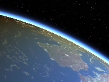
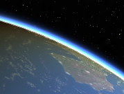
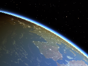
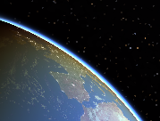
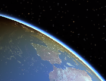
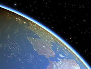
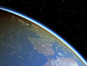

.. _graphics-performance:

Graphics performance
********************

The Gaia Sky uses `OpenGL <https://www.opengl.org/>`__ to render
advanced graphics and thus its performance may be affected
significatively by your graphics card. Below you can find some tips to
improve the performance of the application by tewaking or deactivating
some graphical effects.

Graphics quality setting
========================

Please see the :ref:`graphics-quality-setting` section.

.. _performance-antialiasing:

Antialiasing
============

Antialiasing is a term to refer to a number of techniques for **reducing
jagged edges**, stairstep-like lines that should be smooth. It reduces
the jagged appearance of lines and edges, but it also makes the image
smoother. The result are generally better looking images, even though
this depends on the resolution display device.

There are several groups of antialiasing techniques, some of them
implemented in the Gaia Sky and available for you to choose from the
[[preferences dialog\|Configuration-interface]]. They all come at a
cost, which may vary depending on your system.

+-----------------------+-------------------+--------------------------------------------------------------------------------------------------------------------------------------------------------------------------------------------------------------------------------+
| Name                  | Type              | Description                                                                                                                                                                                                                    |
+=======================+===================+================================================================================================================================================================================================================================+
| **No Antialiasing**   | No antialiasing   | This has no cost since it does not apply any antialiasing technique.                                                                                                                                                           |
+-----------------------+-------------------+--------------------------------------------------------------------------------------------------------------------------------------------------------------------------------------------------------------------------------+
| **FXAA**              | Post-processing   | This has a mild performance cost and produces reasonably good results. If you have a good graphics card, this is super-fast.                                                                                                   |
+-----------------------+-------------------+--------------------------------------------------------------------------------------------------------------------------------------------------------------------------------------------------------------------------------+
| **NFAA**              | Post-processing   | Based on the creation of a normal map to identify edges, this is slightly costlier than FXAA but it may produce better results in some devices.                                                                                |
+-----------------------+-------------------+--------------------------------------------------------------------------------------------------------------------------------------------------------------------------------------------------------------------------------+
| **MSAAx2**            | MSAA              | MSAA is implemented in the graphics card itself and comes at a greater cost than post-processing techniques since it multi-samples the scene and uses its geometry to antialias it. This version uses two samples per pixel.   |
+-----------------------+-------------------+--------------------------------------------------------------------------------------------------------------------------------------------------------------------------------------------------------------------------------+
| **MSAAx4**            | MSAA              | Version of MSAA that uses four samples per pixel, therefore it is costlier than MSAAx2.                                                                                                                                        |
+-----------------------+-------------------+--------------------------------------------------------------------------------------------------------------------------------------------------------------------------------------------------------------------------------+
| **MSAAx8**            | MSAA              | Version of MSAA that uses eight samples per pixel, therefore it is costlier than MSAAx4.                                                                                                                                       |
+-----------------------+-------------------+--------------------------------------------------------------------------------------------------------------------------------------------------------------------------------------------------------------------------------+
| **MSAAx16**           | MSAA              | Version of MSAA that uses sixteen samples per pixel, therefore it is costlier than MSAAx8.                                                                                                                                     |
+-----------------------+-------------------+--------------------------------------------------------------------------------------------------------------------------------------------------------------------------------------------------------------------------------+

.. note:: Since version 1.0.1 the **MSAA has been removed** due to the lack of support for multisampling frame buffers in libgdx.

Here are some sample images.

+-----------------------+-------------+
| Name                  | Image       |
+=======================+=============+
| **No Antialiasing**   | |NOAA|      |
+-----------------------+-------------+
| **FXAA**              | |FXAA|      |
+-----------------------+-------------+
| **NFAA**              | |NFAA|      |
+-----------------------+-------------+
| **MSAAx2**            | |MSAAx2|    |
+-----------------------+-------------+
| **MSAAx4**            | |MSAAx4|    |
+-----------------------+-------------+
| **MSAAx8**            | |MSAAx8|    |
+-----------------------+-------------+
| **MSAAx16**           | |MSAAx16|   |
+-----------------------+-------------+

Some graphics drivers allow you to override the anti-aliasing settings
of applications with some default configuration (usually MSAA or FXAA).
You can also use this feature with the Gaia Sky.

Find more information on antialiasing in the :ref:`graphics-antialiasing` section.

Star brightness
===============

The **star brightness** setting has an effect on the graphics
performance because it will cause more or less stars to be rendered as
quads instead of points, which means multiplying the number of vertices
to send to the GPU. Quads are basically flat polygons to which a texture
is applied (in this case their appearance is controlled by a shader).

The star brightness can be increased or decreased from the
``Star brightness`` slider in the :ref:`interface-lighting` section.

.. hint:: ``CTRL + D`` - activate the **debug mode** to get some information on how many stars are currently being rendered as points and quads as well as the frames per second.

Model detail
============

Some models (mainly spherical planets, planetoids, moons and asteroids)
are automatically generated when the Gaia Sky is initialising and
accept parameters which tell the loader how many vertices the model
should have. These parameters are set in the ``json`` data files and can
have an impact on devices with low-end graphics processors. Let's see an
example:

.. code:: json

    "model" : {
            "args" : [true],
            "type" : "sphere",
            "params" : {
                "quality" : 150,
                "diameter" : 1.0,
                "flip" : false
                },
            "texture" : {
                "base" : "data/tex/neptune.jpg",
                }
        }

The ``quality`` parameter specifies here the number of both vertical and
horizontal divisions that the sphere will have.

Additionally, some other models, such as that of the Gaia spacecraft,
come from a binary model file ``.g3db``. These models are created using
a 3D modelling software and then exported to either ``.g3db`` (``bin``)
or ``.g3dj`` (``JSON``) using
`fbx-conv <https://github.com/libgdx/fbx-conv>`__. You can create
your own low-resolution models and export them to the right format. Then
you just need to point the ``json`` data file to the right low-res model
file. The attribute's name is ``model``.

.. code:: json

    "model" : {
            "args" : [true],
            "model" : "data/models/gaia/gaia.g3db"
        }

Bloom, lens flare and light glow
================================

All post-processing algorithms (those algorithms that are applied to the
image after it has been rendered) take a toll on the graphics card and
can be disabled.

.. hint:: Disable the **light glow** effect for a significant performance boost in low-end graphics cards

-  The **bloom** is not very taxing on the GPU.
-  The **lens flare** effect is a bit harder on the GPU, but most modern
   cards should be able to handle it with no problems.
-  The **light glow** effect is far more demanding, and disabling it can
   result in a significant performance gain in some GPUs. It samples the
   image around the principal light sources using a spiral pattern and
   applies a light glow texture which is rather large.

To disable these post-processing effects, find the controls in the UI
window, as described in the [[lighting\|User-interface#lighting]]
section of the [[User interface]] chapter.

Labels
======

Object labels or names in the Gaia Sky are rendered using a special
``shader`` which implements `distance field
fonts </libgdx/libgdx/wiki/Distance-field-fonts>`__. This means that
labels look great at all distances but it is costlier than the regular
method.

The label factor basically determines the stars for which a label will
be rendered if labels are active. It is a real number between 1 and 5,
and it will be used to scale the ``threshold point angle`` (which
determines the boundary between rendering as ``points`` or as ``quads``)
to select whether a label should be rendered or not.

The label is rendered if the formula below yields true.

::

    viewAngle > threshold_angle_point / label_factor

Currently there is no GUI option for modifying the label factor, so you
must directly edit the configuration file in the [[Scene
properties\|Configuration-files#scene-properties]] section of the
[[Configuration files]] chapter.
