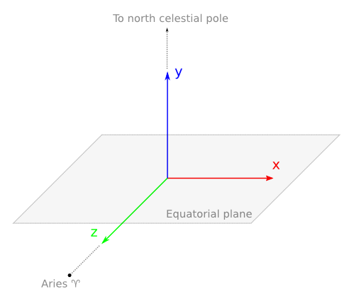

.. _reference-system:

Internal reference system
*************************

The internal cartesian reference system is described as follows: :math:`XZ` is the equatorial plane. :math:`Z` points towards the vernal
equinox point, Aries (♈). :math:`Y` points towards the north celestial
pole. :math:`X` is perpendicular to both :math:`Z` and :math:`Y`.

   Gaia Sky reference system

All the positions and orientations of the entities in the scene are at
some point converted to this reference system for representation. The
same happens with the orientation sensor data in mobile devices.
