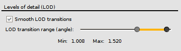

.. _performance:

Performance
***********

The performance of the application may vary significantly depending on
the characteristics of your system. This chapter describes what are the
factors that have an impact in a greater or lesser degree in the
performance of the Gaia Sky and explains how to tweak them. It is
organised in two parts, namely GPU performance (graphics performance)
and CPU performance.

Graphics performance
====================

Refer to the :ref:`graphics-performance` chapter.

CPU performance
===============

The CPU also plays an obvious role in updating the scene state
(positions, orientations, etc.), managing the input and events,
executing the scripts and calling and running the rendering subsystem,
which streams all the texturing and geometric information to the GPU
for rendering. This section describes what are the elements that can
cause a major impact in CPU performance and explains how to tune them.

Multithreading
--------------

When multithreading is enabled the work of the update loop will be distributed
to a number of threads (usually this number is defined by the number of cores/threads
of the main CPU). In our tests, multithreading starts having a positive impact
when more than 4 threads are available. Using a CPU which supports 8 threads 
and enabling multithreading in Gaia Sky results in a significant performance boost.
However, in the case of 4 threads or less, our tests yield that the multithreading
overhead penalty is larger than the gain, resulting in lower FPS. Usually, with
newer CPUs it is a good practice to enable multithreading.

Limiting magnitude
------------------

You can modify the magnitude limit by setting the property ``data.limit.mag``
in the configuration file. This will prevent the loading of stars whose magnitude
is higher (they are fainter) than the specified magnitude, thus relieving the
CPU of some processing. Also, take a look at the
:ref:`data-properties` section.

.. _draw-distance:

Draw distance (levels of detail)
--------------------------------

These settings apply only when using a catalog with levels of detail
like ``TGAS``. We can configure whether we want :ref:`smooth-transitions` between
the levels (fade-outs and fade-ins) and also the draw distance, which is
represented by a range slider. The left knob represents the view angle
above which octants are rendered.

  Draw distance slider in preferences dialog

Basically, the slider sets the view angle above which a particular octree node (axis aligned cubic volume) 
is marked as observed and thus its stars are processed and drawn.

*  Set the knob to the **right** to lower the draw distance and increase performance.
*  Set the knob to the **left** to higher the draw distance at the expense of performance.

.. figure:: img/lodoctree.png
  :alt: Octree and levels of detail

  Octree and levels of detail. Image: `Wikipedia <https://en.wikipedia.org/wiki/Octree>`__.
  

.. _smooth-transitions:  

Smooth transitions
------------------

This setting controls whether particles fade in and out depending on the octree view angle. This will prevent
pop-ins when using a catalog backed by an octree but it **will have a hit on peformance due to the opacity information
being sent to the GPU continuously**. If smooth transitions are enabled, there
is a fade-in between the draw distance angle angle and the draw distance angle + 0.4 rad.
