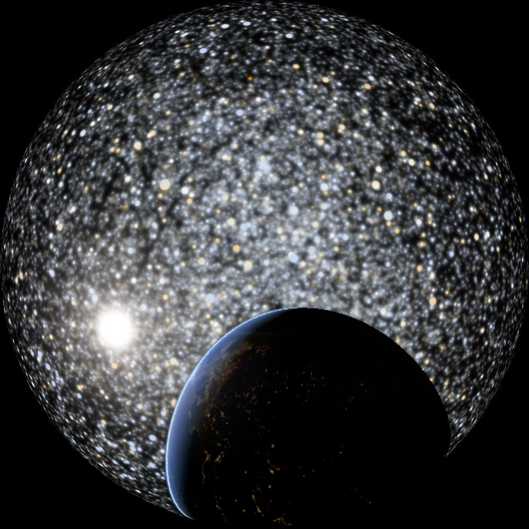

Planetarium mode
****************

Gaia Sky includes a planetarium mode which is specially useful to capture videos to be displayed in a full dome.
To get the best results, the screen resolution (or the screenshots resolution) should have an aspect ratio of 1:1.
In the planetarium mode a few things happen:

*  **Fisheye transform** -- A fisheye transform is applied to the source image.
*  **Field of view** -- The field of view is increased to about 180 degrees.
*  **View skew** -- In focus mode, the view is skewed about 50 degrees downwards.

.. hint:: To activate the planetarium mode, click on the |dome-icon| icon in the camera section of the controls window. Exit by clicking |dome-icon| again.

  Planetarium mode

.. |dome-icon| image:: img/ui/dome-icon.png
