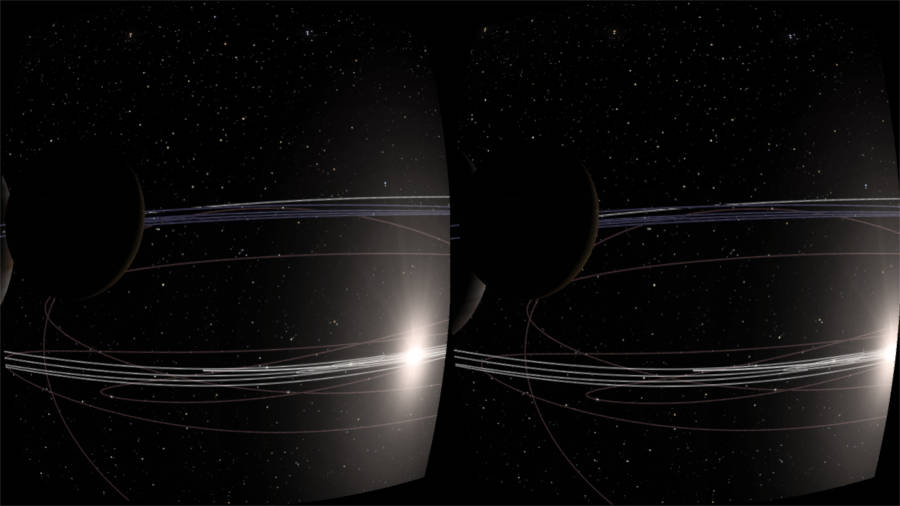
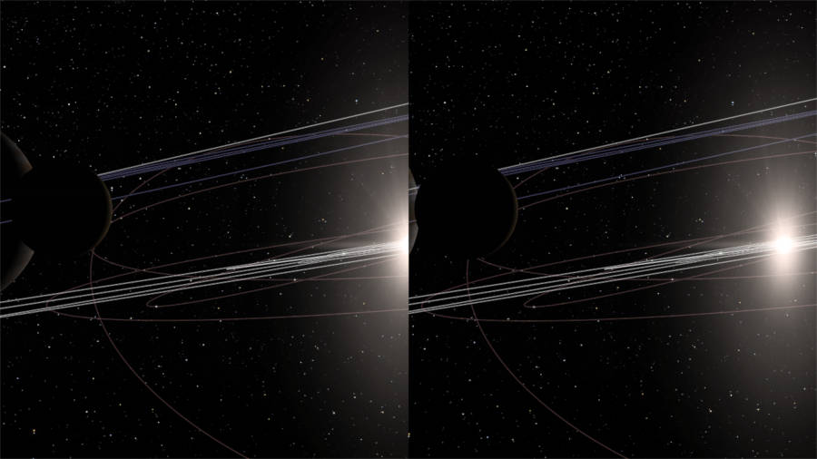
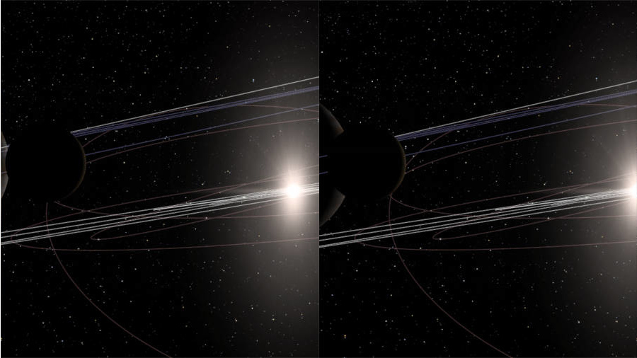
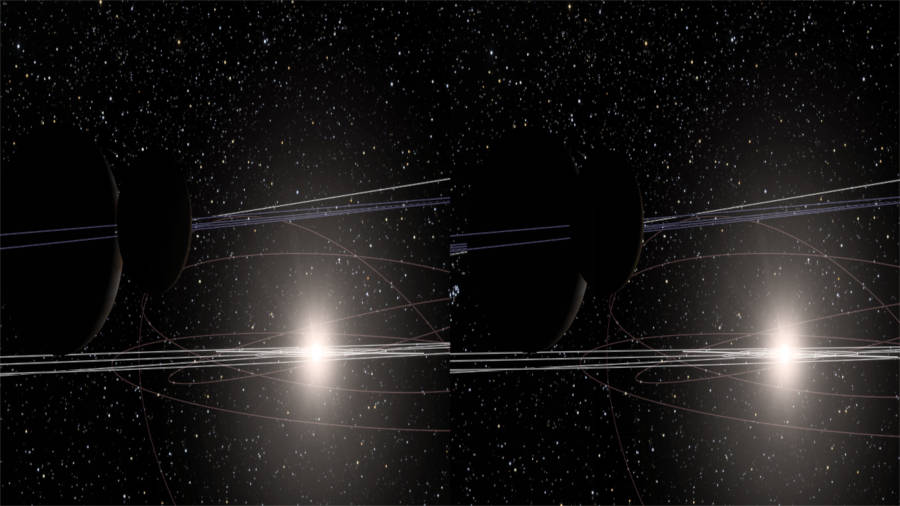
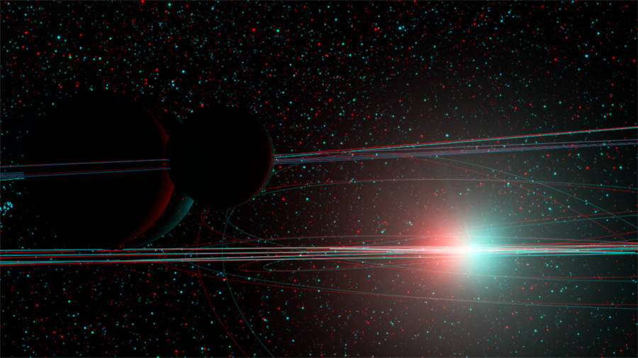

Stereoscopic (3D) mode
**********************

Gaia Sky includes a `stereoscopic
mode <http://en.wikipedia.org/wiki/Stereoscopy>`__ or 3D mode which
outputs two images each intended for each eye, creating the illusion of
depth.

.. hint:: 
		  |3d-icon| or ``LEFT_CTRL`` + ``S`` -- Activate the stereoscopic mode

          ``LEFT_CTRL`` + ``LEFT_SHIFT`` + ``S`` -- Switch between 3D profiles

Stereoscopic profiles
=====================

Usually, as the images are placed side by side (even though most 3DTVs
also support up and down), the right image is intended for the right eye
and the left image is intended for the left eye. This works with 3DTVs
and VR head sets (such as the `Oculus Rift <https://www.oculus.com/>`__,
`Google cardboard <https://www.google.com/get/cardboard/>`__, etc.). In
3DTVs, however, the image is distorted because each half of the TV will
be stretched back to the whole TV area when the 3D mode is on.

.. note:: As of version ``1.5.0``, the head tracking is not yet implemented, so you won't be able to use Gaia Sky interactively with a VR headset. The integration with OpenVR will come soon enough.

Additionally, there are a couple of techniques called cross-eye 3D (you can find
some examples
`here <http://digital-photography-school.com/9-crazy-cross-eye-3d-photography-images-and-how-to-make-them/>`__,
and `here <https://www.youtube.com/watch?v=zBa-bCxsZDk>`__ is a very
nice video teaching the concept and how to achieve it) and parallel view. These work
without any extra equipment and consist on trying to focus your eyes
some distance before or after the actual image so that each eye receives the
correct image. In cross-eye this case the right images goes to the left eye and
the left image goes to the right eye. The opposite is true for parallel view images.

In order to manage all these parameters, we have created 5 stereoscopic
profiles which can be selected by the user and are described below.

-  ``VR_HEADSET`` -- The **left** image goes to the **left** eye. Lens distortion is applied to be viewed with VR glasses.
-  ``Crosseye`` -- The **left** image goes to the **right** eye. No distortion is applied.
-  ``Parallel view`` -- The **left** image goes to the **left** eye. No distortion is applied.
-  ``3DTV`` -- The **left** image goes to the **left** eye. The left and right images are strecthed to fit in a half of the screen.
-  ``Anaglyph 3D`` -- To use with red-cyan glasses. Displays both the left and right images at full resolution. Left image contains the **red** channel, right image contains the **green** and **blue** channels.

.. hint:: ``L-CTRL`` + ``L-SHIFT`` + ``S`` -- Switch between 3D profiles

+-------------------+----------+
| Profile           | Image    |
+===================+==========+
| **VR_HEADSET**    | |VR|     |
+-------------------+----------+
| **Crosseye**      | |XEYE|   |
+-------------------+----------+
| **Parallel view** | |PARA|   |
+-------------------+----------+
| **3DTV**          | |3DTV|   |
+-------------------+----------+
| **Anaglyph**      | |ANAG|   |
+-------------------+----------+

          
.. |3d-icon| image:: img/ui/3d-icon.png
