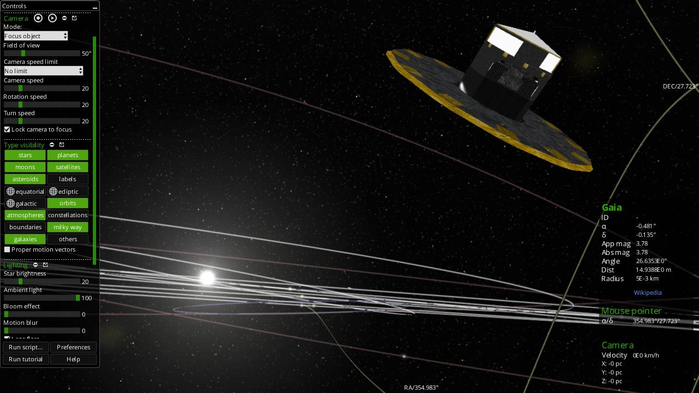
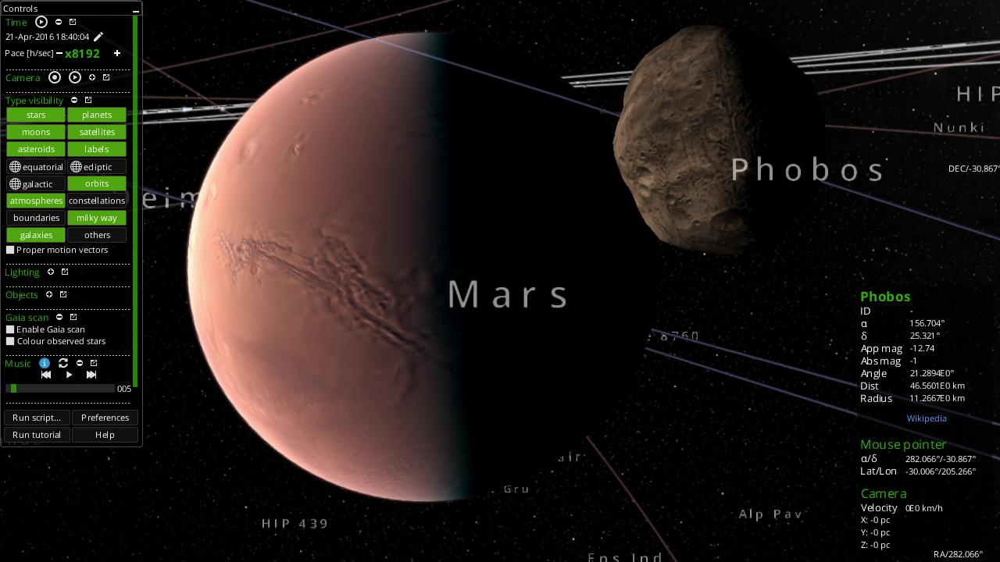
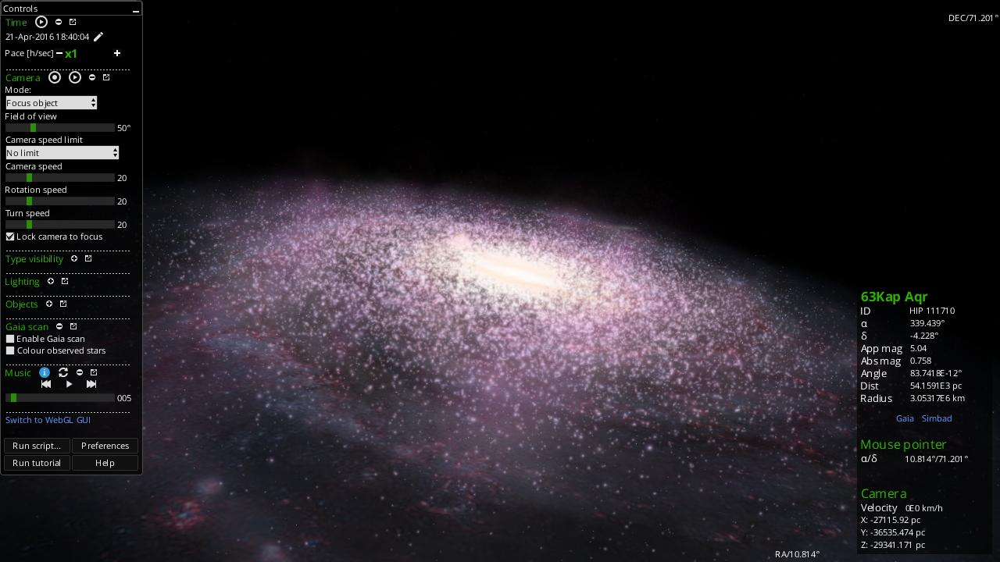

Gaia Sky
********

.. figure:: img/GaiaSkySplash-s.jpg
   :alt: Gaia Sky logo

|Build status|

.. note:: Gaia Sky just hit version 1.0.0!

What is Gaia Sky
================

**Gaia Sky** is a real-time, 3D, astronomy visualisation software that
runs on Windows, Linux and MacOS. It lives in the framework of
`ESA <http://www.esa.int/ESA>`__'s `Gaia
mission <http://sci.esa.int/gaia>`__ to chart about 1 billion stars of
our Milky Way Galaxy. It is developed in the Gaia group of the
`Astronomisches Rechen-Institut <www.ari.uni-heidelberg.de>`__
(`ZAH <www.zah.uni-heidelberg.de>`__, `Universität
Heidelberg <www.uni-heidelberg.de>`__).

.. image:: img/screenshots/screenshot_00025.jpg
  :width: 24%

*  Official site: `GaiaSky@ARI <http://www.zah.uni-heidelberg.de/gaia2/outreach/gaiasky/>`__
*  Product page: `Gaia Sky <http://ari-zah.github.io/gaiasky>`__
*  Documentation: `You are in it! <https://gaia-sky.readthedocs.io>`__

Main features
-------------

- **Free and open source** -- The application is free and open source and will stay this way. You can even contribute to the development or the translations.
- **From Gaia to the cosmos** -- Move freely through the cosmos and descend to the surface of any Planet or do a close-up inspection of Gaia. All movement and transitions are seamless!
- **Gaia** - Observe Gaia in its orbit and discover its movement in the sky and its attitude.
- **3D ready** -- With 4 stereoscopic modes: Anaglyphic (red-cyan), VR headset, 3DTV, cross-eye.
- **Planetarium projection mode** -- Ready to produce videos for full dome systems.
- **360 mode** -- Ready to produce 360 videos.
- **Use your own data** -- Comes with ``HYG`` and ``TGAS``. Supports ``VOTable``, ``FITS``, ``CSV`` and all formats accepted by ``STIL``.
- **Navigate the galaxy** -- Support for controllers and gamepads makes navigating the Galaxy a piece of cake.
- **Spacecraft mode** -- Jump aboard a spacecraft to navigate the skies!
- **Record and play your camera paths** -- Ready to record and play camera paths off-the-shelf.
- **Scriptable and extensible** -- Use Python to script and extend the capabilities of Gaia Sky.
- **Internationalised** -- Translated so far to English, German, Spanish and Catalan.

.. |Build status| image:: https://circleci.com/gh/ari-zah/gaiasky/tree/master.svg?style=svg
   :target: https://circleci.com/gh/ari-zah/gaiasky/tree/master

Contents
========

.. toctree::
   :maxdepth: 3

   Requirements
   Running-the-software
   Documentation
   Javadoc
   Changelog
   Screenshots
   Contact-information
