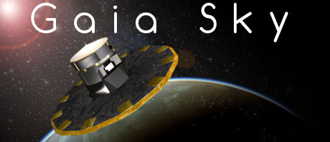

|Build status| |License|

.. note:: 2018/06/14 -- Version 2.0.1 is out now!

What is Gaia Sky
================

**Gaia Sky** is a real-time, 3D, astronomy visualisation software that
runs on Windows, Linux and MacOS. It lives in the framework of
`ESA <http://www.esa.int/ESA>`__'s `Gaia
mission <http://sci.esa.int/gaia>`__ to chart about 1 billion stars of
our Milky Way Galaxy. It is developed in the Gaia group of the
`Astronomisches Rechen-Institut <http://ari.uni-heidelberg.de>`__
(`ZAH <http://zah.uni-heidelberg.de>`__, `Universität
Heidelberg <http://uni-heidelberg.de>`__).

.. image:: http://gaia.ari.uni-heidelberg.de/gaiasky/files/screenshots/dr2/thumbs/20180420_screenshot_00000.jpg
  :target: http://gaia.ari.uni-heidelberg.de/gaiasky/files/screenshots/dr2/20180420_screenshot_00000.png
  :width: 24%

.. image:: http://gaia.ari.uni-heidelberg.de/gaiasky/files/screenshots/dr2/thumbs/20180420_screenshot_00002.jpg
  :target: http://gaia.ari.uni-heidelberg.de/gaiasky/files/screenshots/dr2/20180420_screenshot_00002.png
  :width: 24%

.. image:: http://gaia.ari.uni-heidelberg.de/gaiasky/files/screenshots/dr2/thumbs/20180420_screenshot_00001.jpg
  :target: http://gaia.ari.uni-heidelberg.de/gaiasky/files/screenshots/dr2/20180420_screenshot_00001.png
  :width: 24%

.. image:: http://gaia.ari.uni-heidelberg.de/gaiasky/files/screenshots/dr2/thumbs/20180420_screenshot_00014.jpg
  :target: http://gaia.ari.uni-heidelberg.de/gaiasky/files/screenshots/dr2/20180420_screenshot_00014.png
  :width: 24%

*  Visit our `home page <http://www.zah.uni-heidelberg.de/gaia/outreach/gaiasky/>`__
*  Read the `documentation <http://gaia-sky.rtfd.io>`__
*  Submit a `bug or a feature request <https://github.com/langurmonkey/gaiasky/issues>`__

Main features
-------------

- **Free and open source** -- The application is free and open source and will stay this way. You can even contribute to the development or the translations.
- **From Gaia to the cosmos** -- Move freely through the cosmos and descend to the surface of any Planet or do a close-up inspection of Gaia. All movement and transitions are seamless!
- **Gaia** - Observe Gaia in its orbit and discover its movement in the sky and its attitude.
- **3D ready** -- With 5 stereoscopic profiles: Anaglyphic (red-cyan), VR headset, 3DTV, cross-eye and parallel view.
- **VR ready** -- Still work in progress but already functional, Gaia Sky VR works with any VR HMD compatible with OpenVR. See the :ref:`gaiasky-vr` section.
- **Planetarium projection mode** -- Ready to produce videos for full dome systems.
- **360 mode** -- Ready to produce 360 videos.
- **Use your own data** -- Comes with ``TGAS``, ``NBG`` and ``SDSS``. Supports ``VOTable``, ``FITS``, ``CSV`` and all formats accepted by ``STIL``.
- **Navigate the galaxy** -- Support for controllers and gamepads makes navigating the Galaxy a piece of cake.
- **Spacecraft mode** -- Jump aboard a spacecraft to navigate the skies!
- **Record and play your camera paths** -- Ready to record and play camera paths off-the-shelf.
- **Scriptable and extensible** -- Use Python to script and extend the capabilities of Gaia Sky.
- **Internationalised** -- Translated so far to English, German, Spanish, French, Catalan and Slovenian.

.. |Build status| image:: https://circleci.com/gh/langurmonkey/gaiasky.svg?style=shield&circle-token=:circle-token
   :target: https://circleci.com/gh/langurmonkey/gaiasky/tree/master

.. |License| image:: https://img.shields.io/badge/License-MPL%202.0-brightgreen.svg
   :target: https://opensource.org/licenses/MPL-2.0

Contents
========

.. toctree::
   :maxdepth: 3

   Downloads
   Requirements
   Running-gaia-sky
   Documentation
   Gaia-sky-vr
   Javadoc
   Changelog
   Contact-information
